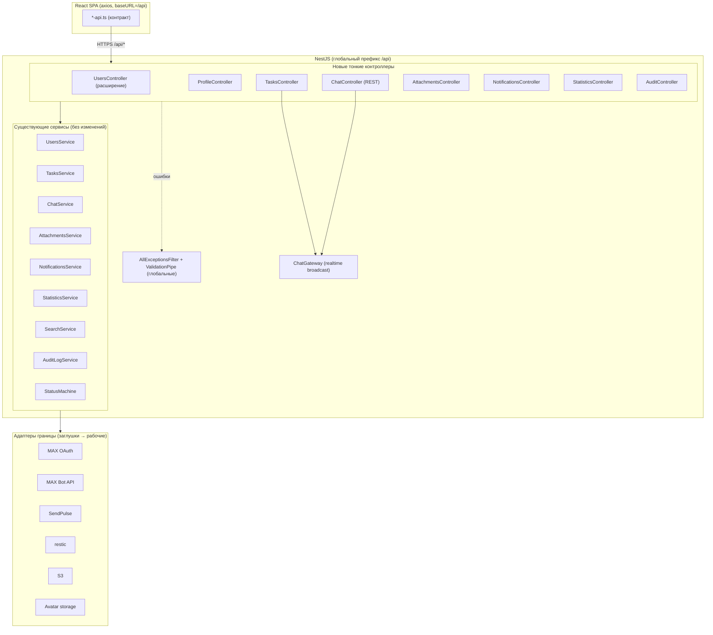

# Design Document

## Overview

«Система поручений» имеет полностью реализованный и протестированный доменный слой (сервисы NestJS) и набор property-тестов (61 свойство), но **слой HTTP REST почти полностью отсутствует**, а часть внешних интеграций представлена безопасными заглушками (`Unavailable*`). Фронтенд React написан под REST-контракт с базовым префиксом `/api`, которого backend не предоставляет, поэтому всё, кроме `auth/*`, `GET /users` и `POST /users/invite`, возвращает 404.

Этот документ описывает, как «дотянуть» уже готовую логику до фронтенда: добавить тонкие контроллеры-адаптеры над существующими сервисами, эндпоинты отдачи файлов, привязку бутстрапа (глобальный префикс, CORS, лимиты загрузки) и заменить заглушки внешних адаптеров рабочими реализациями. Доменная логика **не переписывается** — контроллеры только маршрутизируют HTTP-запрос на существующий метод сервиса, преобразуют DTO и полагаются на уже зарегистрированные глобальные `ValidationPipe` и `AllExceptionsFilter`.

### Ключевой принцип

Контроллеры должны быть «тонкими»: разбор параметров → вызов метода сервиса → возврат представления. Вся валидация бизнес-правил, права доступа и доменные ошибки уже реализованы в сервисах и покрыты тестами. Это минимизирует риск регрессии и сохраняет прохождение существующих property-тестов (Req 10.4).

## Текущее состояние (по результатам аудита)

### Что реализовано
- Доменные сервисы всех модулей: `UsersService`, `TasksService`, `ChatService`, `AttachmentsService`, `NotificationsService`, `StatisticsService`, `SearchService`, `AuditLogService`, `StatusMachine`, `BackupService`.
- Глобальная инфраструктура: `CommonModule` регистрирует `APP_FILTER` (`AllExceptionsFilter`) и `APP_PIPE` (`ValidationPipe`); воркеры BullMQ (`EmailWorker`, `NotificationDeliveryWorker`, `DeadlineReminderWorker`, `BackupWorker`) зарегистрированы как провайдеры.
- Контроллеры: `AppController` (health), `AuthController` (login/max/set-password/change-password/me/logout), `UsersController` (только `GET /users`, `POST /users/invite`), `MaxBotWebhookController`.
- Socket.IO `ChatGateway`; Prisma-схема и первичная миграция.
- 61 property-тест + unit-тесты (705 проходят).

### Чего не хватает (разрывы)
1. **Глобальный префикс `/api`** не установлен в `main.ts` — клиент бьёт в `/api/*`, backend слушает `/*`.
2. **REST-контроллеры** для задач, чата/сообщений, вложений, уведомлений, статистики, журнала, профиля и большей части управления пользователями.
3. **Эндпоинты отдачи файлов**: `GET /attachments/:id/content`, `GET /attachments/:id/thumbnail`, отдача аватара.
4. **CORS и лимиты тела/загрузки** (25 МБ вложения, 5 МБ аватар).
5. **Рабочие адаптеры** вместо `Unavailable*`: MAX OAuth, MAX Bot API, restic, S3, файловое хранилище аватаров; проверка реальности SendPulse-клиента.
6. **Сквозные (HTTP) интеграционные тесты** — текущие property-тесты обходят HTTP.

### Полная карта контракта (frontend → backend)

| Эндпоинт (под `/api`) | Метод фронтенда | Сервис-делегат | Статус |
|---|---|---|---|
| `POST /auth/login` `…/max` `…/set-password` `…/change-password` `GET /auth/me` `POST /auth/logout` | auth-api | AuthService | ✅ есть |
| `GET /users` · `POST /users/invite` | users-api | AuthService/UserRepository | ✅ есть |
| `GET /users/deleted` | users-api | UsersService | ❌ |
| `GET /users/directory` | tasks-api | UsersService/UserRepository | ❌ |
| `PATCH /users/:id` | users-api | UsersService.updateProfile | ❌ |
| `DELETE /users/:id?mode=` | users-api | UsersService.deleteUser | ❌ |
| `POST /users/:id/restore` | users-api | UsersService.restoreUser | ❌ |
| `POST /users/:id/transfer-admin` | users-api | UsersService.transferAdmin | ❌ |
| `POST /profile/avatar` | auth-api | UsersService.setAvatar | ❌ |
| `POST /profile/max` | auth-api | UsersService.linkMax | ❌ |
| `GET /tasks` | tasks-api | SearchService/TasksService.listVisible | ❌ |
| `GET /tasks/:id` | tasks-api | TasksService | ❌ |
| `POST /tasks` | tasks-api | TasksService.create | ❌ |
| `PATCH /tasks/:id` | tasks-api | TasksService.update | ❌ |
| `POST /tasks/:id/assign` | tasks-api | TasksService.assign | ❌ |
| `POST /tasks/:id/status` | status-api | StatusMachine + TasksService | ❌ |
| `GET /tasks/:id/audit` | audit-api | AuditLogService.list | ❌ |
| `GET /tasks/:id/messages` | chat-api | ChatService | ❌ |
| `POST /tasks/:id/messages` | chat-api | ChatService.sendMessage | ❌ |
| `PATCH /messages/:id` | chat-api | ChatService.editMessage | ❌ |
| `DELETE /messages/:id` | chat-api | ChatService.deleteMessage | ❌ |
| `POST /messages/:id/read` | chat-api | ChatService.markRead | ❌ |
| `GET /messages/:id/readers` | chat-api | ChatService | ❌ |
| `GET /tasks/:id/attachments` | chat-api | ChatService.listAttachments | ❌ |
| `POST /tasks/:id/attachments` | chat-api | AttachmentsService.upload | ❌ |
| `GET /attachments/:id/content` | attachments | AttachmentsService.openCompressed | ❌ |
| `GET /attachments/:id/thumbnail` | attachments | AttachmentsService | ❌ |
| `GET /notifications` | notifications-api | NotificationRepository | ❌ |
| `POST /notifications/messages/seen` | notifications-api | NotificationsService.clearMessageNotification | ❌ |
| `DELETE /notifications/:id` | notifications-api | NotificationRepository | ❌ |
| `GET /statistics` | statistics-api | StatisticsService.compute | ❌ |
| `GET /statistics/export` | statistics-api | StatisticsService.export | ❌ |

## Architecture



### Решения

| Решение | Выбор | Обоснование |
|---|---|---|
| Глобальный префикс | `app.setGlobalPrefix('api')` в `main.ts`, исключая health при необходимости | Согласует контракт с `VITE_API_BASE_URL=/api` без правок десятков вызовов фронтенда. |
| Толщина контроллеров | Тонкие адаптеры | Вся логика и права уже в сервисах и протестированы; снижает риск регрессии. |
| Чат: REST + realtime | REST-контроллер вызывает `ChatService`, который уже триггерит broadcast через `ChatGateway` | Фронтенд использует REST для истории/отправки и Socket.IO для живых обновлений; источник истины — `ChatService`. |
| Загрузка файлов | `FileInterceptor` (multer, память/поток) + лимиты | `AttachmentsService.upload` принимает поток/буфер; лимит 25 МБ задаётся на интерсепторе и проверяется сервисом. |
| Отдача файлов | `StreamableFile` из контролируемого эндпоинта | Вложения хранятся вне веб-корня и отдаются только после проверки прав (Req 19.8). |
| Представления (DTO ответа) | Переиспользовать существующие мапперы (`toAdminUser` и аналоги), добавить недостающие | Единый формат, отсутствие утечки внутренних полей. |
| Внешние адаптеры | Реализовать рабочие классы, переопределив привязку портов в модулях | Порты уже определены; замена `useExisting`/`useClass` не трогает доменную логику. |
| Конфигурация интеграций | Через `AppConfigService` (уже есть env для MAX/SendPulse/S3) | Учётные данные читаются из конфигурации; отсутствие — предсказуемая деградация. |

## Components and Interfaces

### Бутстрап (`main.ts`)
- `app.setGlobalPrefix('api')`.
- `app.enableCors({ origin: <frontend>, credentials: true })` (для dev; в проде один источник через Nginx).
- Повышение лимита тела для multipart на маршрутах загрузки (через настройки `FileInterceptor`/multer), JSON-лимит — разумный дефолт.
- Глобальные `ValidationPipe`/`AllExceptionsFilter` уже регистрируются `CommonModule` (дублировать не нужно).

### UsersController (расширение существующего)
Добавляемые маршруты, все под `SessionAuthGuard`, проверка роли Администратора внутри (как уже сделано для `list`):
```typescript
@Patch(':id')        update(id, dto: UpdateUserDto)          // → UsersService.updateProfile (Req 6.2, 6.3)
@Delete(':id')       remove(id, @Query('mode') mode)         // → UsersService.deleteUser (Req 8)
@Post(':id/restore') restore(id, dto: RestoreUserDto)        // → UsersService.restoreUser (Req 7)
@Post(':id/transfer-admin') transfer(id, req)                // → UsersService.transferAdmin (Req 3)
@Get('deleted')      listDeleted()                           // → UsersService (deleted + emails)
@Get('directory')    directory()                             // → активные пользователи для назначений
```
Примечание: порядок объявления статических путей (`deleted`, `directory`) должен исключать конфликт с `:id`.

### ProfileController (новый)
```typescript
@Post('avatar') @UseInterceptors(FileInterceptor('avatar', { limits: { fileSize: 5MB } }))
  uploadAvatar(file, req)        // → UsersService.setAvatar(req.userId, req.userId, file) (Req 6.4)
@Post('max') linkMax(dto, req)   // → exchange authCode via MAX OAuth → UsersService.linkMax (Req 6.6, 16.2)
```

### TasksController (новый)
```typescript
@Get()           list(query: TaskQueryDto, req)   // → SearchService.search / TasksService.listVisible (Req 2.8–2.10, 18)
@Get(':id')      get(id, req)                      // → TasksService.getVisible (Req 2.12)
@Post()          create(dto: CreateTaskDto, req)   // → TasksService.create (Req 9)
@Patch(':id')    update(id, dto: UpdateTaskDto, req) // → TasksService.update (Req 10.12, 10.13)
@Post(':id/assign') assign(id, dto: AssignmentDto, req) // → TasksService.assign (Req 2.4–2.7)
@Post(':id/status') changeStatus(id, dto: ChangeStatusDto, req) // → StatusMachine + TasksService (Req 10)
```

### ChatController (новый, REST поверх ChatService)
```typescript
@Get('tasks/:id/messages')   listMessages(id, req)
@Post('tasks/:id/messages')  send(id, dto, req)       // → ChatService.sendMessage (rate-limited, Req 19.1)
@Patch('messages/:id')       edit(id, dto, req)
@Delete('messages/:id')      remove(id, req)
@Post('messages/:id/read')   markRead(id, req)
@Get('messages/:id/readers') readers(id, req)
```
Эндпоинты делегируют `ChatService`; live-трансляция выполняется самим сервисом через `ChatGateway`.

### AttachmentsController (новый)
```typescript
@Get('tasks/:id/attachments')  list(id, req)                 // → ChatService.listAttachments (Req 11.10)
@Post('tasks/:id/attachments') @UseInterceptors(FileInterceptor('file', { limits: { fileSize: 25MB } }))
  upload(id, file, req)                                       // → AttachmentsService.upload (Req 12)
@Get('attachments/:id/content')   content(id, req): StreamableFile  // → openCompressed (Req 12.8, 12.9, 19.8)
@Get('attachments/:id/thumbnail') thumbnail(id, req): StreamableFile // → миниатюра/значок (Req 12.6, 12.7)
```

### NotificationsController (новый)
```typescript
@Get()                    list(req)                 // уведомления текущего пользователя (Req 13.1)
@Post('messages/seen')    seen(dto, req)            // → clearMessageNotification (Req 14.4)
@Delete(':id')            dismiss(id, req)          // скрытие уведомления
```

### StatisticsController (новый)
```typescript
@Get()        compute(query: PeriodDto, req)        // → StatisticsService.compute, только ADMIN (Req 17.1–17.8)
@Get('export') export(query, req): StreamableFile   // → StatisticsService.export (Req 17.9, 17.10)
```

### AuditController (новый или внутри TasksController)
```typescript
@Get('tasks/:id/audit') list(id, req)               // → AuditLogService.list (Req 20.2, 20.3)
```

### Рабочие адаптеры границы
Заменяют `Unavailable*` через переопределение привязки портов в соответствующих модулях:
- `MaxOAuthAdapter` → `MAX_OAUTH_PORT` (обмен authCode → maxUserId; HTTP к MAX OAuth).
- `MaxBotApiAdapter` → `MAX_BOT_API_PORT` (вызовы Bot API: отправка уведомлений/сообщений, удаление по просмотру).
- `MaxDeliveryAdapter` → `MAX_DELIVERY_PORT` (доставка уведомлений в MAX поверх Bot API).
- `ResticBackupAdapter` → `RESTIC_BACKUP_PORT` (вызов restic).
- `S3OffsiteUploadAdapter` → `OFFSITE_UPLOAD_PORT` (выгрузка в S3).
- `FileSystemAvatarStorage` → `AVATAR_STORAGE` (хранение аватара вне веб-корня).
- Проверить/доработать `SendPulseClient` (`MAILER_PROVIDER`) — реальный HTTP-вызов SendPulse.

Все адаптеры читают учётные данные из `AppConfigService`; при отсутствии конфигурации — логируют и фиксируют неуспех без падения (Req 9.6).

## Data Models

Эта спека **не вводит новых сущностей хранилища** — модель данных полностью определена в исходном ТЗ (`prisma/schema.prisma`: User, UserEmail, Task, TaskAssignment, Chat, Message, Attachment, MessageRead, AuditEntry, Notification, Session, MaxLink, ChatMute, DeadlineReminder, BackupRecord). Изменения схемы не требуются.

Вводятся только **транспортные модели (DTO) на границе HTTP** — для запросов и ответов контроллеров. Они не хранятся и служат контрактом с фронтендом.

### Request DTO (валидируются глобальным ValidationPipe)

| DTO | Поля (с ограничениями) | Используется |
|---|---|---|
| `UpdateUserDto` | `email?` (email-формат), `name?` (1..N) | `PATCH /users/:id` |
| `RestoreUserDto` | `email` (из сохранённых адресов) | `POST /users/:id/restore` |
| `LinkMaxDto` | `authCode` (непустой) | `POST /profile/max` |
| `CreateTaskDto` | `title` 1..200, `description?` 0..5000, `deadline` (дата), `executorIds` 1..100, `managerIds` 1..100 | `POST /tasks` |
| `UpdateTaskDto` | `title?`, `description?`, `deadline?` (те же границы) | `PATCH /tasks/:id` |
| `AssignmentDto` | `executorIds[]`, `managerIds[]` | `POST /tasks/:id/assign` |
| `ChangeStatusDto` | `action` (enum: COMPLETE/REOPEN/CANCEL/RETURN/REQUEST_ADMIN/ADMIN_SET/CLEAR_ADMIN), `target?` | `POST /tasks/:id/status` |
| `TaskQueryDto` | `text?` 1..256, фильтры (статус/дедлайн/участники), `page?`, `pageSize?` (≤100) | `GET /tasks` |
| `SendMessageDto` | `text` 1..4000, `attachmentIds?[]` | `POST /tasks/:id/messages` |
| `EditMessageDto` | `text` 1..4000 | `PATCH /messages/:id` |
| `MessageSeenDto` | `messageId` | `POST /notifications/messages/seen` |
| `PeriodDto` | `from?`, `to?` (ISO), `format?` (csv/xlsx) | `GET /statistics`, `/statistics/export` |

### Response-представления (мапперы, без утечки внутренних полей)

Переиспользуются существующие мапперы (например, `toAdminUser`); добавляются недостающие представления `TaskCardView`, `TaskDetailView`, `ChatMessageView`, `AttachmentMetaView`, `NotificationView`, `StatisticsView`, `AuditEntryView` — строго соответствующие типам фронтенда в `frontend/src/lib/*-api.ts`. Бинарные эндпоинты (`/content`, `/thumbnail`, `/statistics/export`) возвращают `StreamableFile`.

## Correctness Properties

Свойства HTTP-слоя, проверяемые контроллерными и e2e-тестами. Доменные свойства (1–61) остаются за исходным ТЗ и не дублируются.

### Property 1: Полнота контракта

*Для любого* пути, вызываемого из `frontend/src/lib/*-api.ts`, существует зарегистрированный маршрут backend под префиксом `/api` с совпадающими методом и шаблоном пути.

**Validates: Requirements 10.3, 1.1**

### Property 2: Защита маршрутов

*Для любого* защищённого эндпоинта запрос без действующего токена сессии отклоняется (401/403) и не выполняет доменную операцию.

**Validates: Requirements 1.5**

### Property 3: Сохранение прав сервиса

*Для любого* запроса контроллер делегирует доменному сервису без ослабления проверок прав: операция, отклоняемая сервисом (роль/назначение/инвариант), отклоняется и через HTTP с тем же классом ошибки.

**Validates: Requirements 2.7, 2.8, 4.2, 5.2, 6.5, 7.4, 8.1**

### Property 4: Нулевая регрессия

*Для любого* существующего unit/property-теста доменного слоя результат остаётся «проходит» после введения контроллеров и адаптеров.

**Validates: Requirements 10.4**

## Error Handling

- Доменные исключения (`AccessDeniedException`, `ValidationException`, `EntityNotFoundException`, `StateConflictException`, `RateLimitException`) уже преобразуются глобальным `AllExceptionsFilter` в `{ code, message, details? }` с корректными HTTP-кодами (400/401/403/404/409/422/429). Контроллеры не ловят их вручную.
- Валидация DTO выполняется глобальным `ValidationPipe`; контроллеры объявляют DTO с `class-validator`.
- Отдача файлов: при отсутствии файла/прав — 404/403 через те же исключения; частичные/повреждённые файлы не отдаются.
- Экспорт статистики (`responseType: blob` на клиенте) — ошибки также в JSON-формате (клиент уже умеет читать Blob-ошибку).

## Testing Strategy

- **Сохранение существующих тестов**: ввод контроллеров не меняет сервисы → все 705 unit/property-тестов должны продолжать проходить (Req 10.4).
- **Контроллерные unit-тесты**: для каждого контроллера — тест маршрутизации на мок сервиса (проверка передачи параметров, кода ответа, проверки роли/прав).
- **e2e/HTTP-тесты** (Supertest, поднятый Nest-приложение с моками внешних границ): ключевые потоки — вход; создание задачи; отправка сообщения со сменой статуса; передача роли администратора; загрузка и отдача вложения; расчёт статистики; отказ без токена (Req 10.1, 10.2).
- **Контрактная проверка**: тест/скрипт, сверяющий, что каждый путь из `frontend/src/lib/*-api.ts` имеет зарегистрированный маршрут под `/api` (Req 10.3).
- **Адаптеры**: unit-тесты адаптеров с моками HTTP-клиента; интеграционные — опционально против тестовых стендов.

## Migration / Rollout

1. Бутстрап (`/api`, CORS, лимиты) — первым, иначе тесты HTTP не пройдут.
2. Контроллеры по областям, начиная с самых заметных пользователю (Users/transfer-admin, Tasks, Chat/Attachments), затем Notifications/Statistics/Audit/Profile.
3. Адаптеры границы — отдельным этапом; до их готовности система работает с предсказуемой деградацией (заглушки логируют недоступность).
4. e2e и контрактная проверка — в конце каждого этапа.
