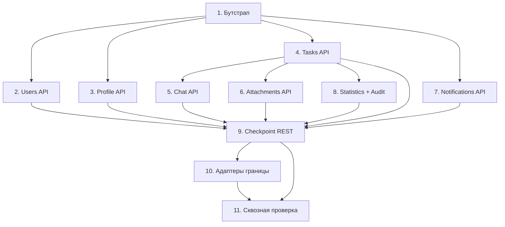

# Implementation Plan: Завершение REST API и интеграций

## Overview

План реализации недостающего HTTP-слоя и рабочих адаптеров «Системы поручений». Доменные сервисы и property-тесты уже готовы — задачи добавляют **тонкие контроллеры** над существующими сервисами, эндпоинты отдачи файлов, привязку бутстрапа и замену заглушек внешних интеграций рабочими адаптерами. Существующие unit/property-тесты (705) должны продолжать проходить.

Подзадачи с `*` — тесты (могут быть отложены для ускорения, но обязательны для приёмки). Каждая задача ссылается на требования этой спеки и исходного ТЗ `task-assignment-system`.

## Tasks

- [x] 1. Бутстрап HTTP-слоя и согласование путей
  - [x] 1.1 Установить глобальный префикс и CORS
    - В `main.ts` добавить `app.setGlobalPrefix('api')`; включить CORS с источником фронтенда и `credentials: true`
    - Убедиться, что `auth/*`, `GET /users`, `POST /users/invite`, health продолжают работать под новым префиксом
    - _Requirements: 1.1, 1.4, 1.6_

  - [x] 1.2 Настроить лимиты загрузки и проверить глобальные pipe/filter
    - Подтвердить регистрацию `ValidationPipe`/`AllExceptionsFilter` (CommonModule); задать лимиты multer (25 МБ/5 МБ) на интерсепторах загрузки
    - _Requirements: 1.2, 1.3_

  - [ ]* 1.3 e2e-тест бутстрапа
    - Проверить доступность `GET /api/health` и `GET /api/auth/me` (401 без токена), отказ без токена на защищённом маршруте
    - _Requirements: 1.5, 10.2_

- [x] 2. REST API управления пользователями (расширение UsersController)
  - [x] 2.1 Реализовать transfer-admin, update, delete, restore
    - `POST /users/:id/transfer-admin` → `transferAdmin`; `PATCH /users/:id` → изменение email/имени; `DELETE /users/:id?mode=` → `deleteUser`; `POST /users/:id/restore` → `restoreUser`; проверка роли Администратора
    - _Requirements: 2.1, 2.2, 2.3, 2.4, 2.7, 2.8 / ТЗ 3, 6.2, 6.3, 7, 8_

  - [x] 2.2 Реализовать списки удалённых и справочник пользователей
    - `GET /users/deleted` (удалённые + сохранённые адреса); `GET /users/directory` (активные для назначений); корректный порядок маршрутов относительно `:id`
    - _Requirements: 2.5, 2.6 / ТЗ 7.3, 9.1, 2.4_

  - [x]* 2.3 Контроллерные тесты управления пользователями
    - Маршрутизация на мок `UsersService`, проверка роли, проброс доменных ошибок в единый формат
    - _Requirements: 2.7, 2.8, 10.4_

- [x] 3. ProfileController (аватар, привязка MAX)
  - [x] 3.1 Реализовать загрузку аватара и привязку MAX
    - `POST /profile/avatar` (FileInterceptor, ≤5 МБ) → `setAvatar`; `POST /profile/max` → обмен authCode и `linkMax`; хранение вне веб-корня
    - _Requirements: 3.1, 3.2, 3.3, 3.4 / ТЗ 6.4, 6.6, 16.2, 19.8_

  - [x]* 3.2 Тесты профиля
    - Отклонение превышения 5 МБ/неподдерживаемого формата; делегирование текущему пользователю
    - _Requirements: 3.3, 10.4_

- [x] 4. TasksController
  - [x] 4.1 Реализовать CRUD и назначения задач
    - `GET /tasks` (поиск/фильтр/пагинация в пределах видимости) → `SearchService`/`listVisible`; `GET /tasks/:id`; `POST /tasks` → `create`; `PATCH /tasks/:id` → `update`; `POST /tasks/:id/assign` → `assign`
    - _Requirements: 4.1, 4.2, 4.3, 4.4, 4.5, 4.7 / ТЗ 2.8–2.12, 9, 10.12, 10.13, 18_

  - [x] 4.2 Реализовать смену статуса
    - `POST /tasks/:id/status` → переход через `StatusMachine` + сохранение; отказ при недопустимом/неавторизованном переходе; запись в журнал и уведомления через подключённые порты
    - Примечание: уведомление о смене статуса (Req 13.6) оставлено TODO — путь `TaskNotificationRouter.notifyStatusChanged` существует, но требует расширения порта `TaskNotifier`; будет подключено в этапе доработки уведомлений
    - _Requirements: 4.6, 4.7 / ТЗ 10.4–10.10, 10.14, 10.15, 13, 20_

  - [x]* 4.3 Контроллерные/e2e тесты задач
    - Видимость по роли; отказ к чужой задаче без раскрытия; валидация параметров; недопустимый переход статуса
    - _Requirements: 4.1, 4.2, 4.6, 10.1, 10.4_

- [x] 5. ChatController (REST поверх ChatService)
  - [x] 5.1 Реализовать историю и операции с сообщениями
    - `GET /tasks/:id/messages`; `POST /tasks/:id/messages` (rate-limited) → `sendMessage`; `PATCH /messages/:id` → `editMessage`; `DELETE /messages/:id` → `deleteMessage`; `POST /messages/:id/read` → `markRead`; `GET /messages/:id/readers`
    - Убедиться, что live-трансляция через `ChatGateway` срабатывает при REST-операциях
    - _Requirements: 5.1, 5.2, 5.3, 5.4, 5.5, 5.6, 5.7, 5.8 / ТЗ 11, 10.1–10.3, 19.1_

  - [x]* 5.2 Тесты чата
    - Права на edit/delete; валидация длины 1–4000; авто-переход статуса; broadcast вызывается
    - _Requirements: 5.2, 5.3, 5.7, 10.4_

- [x] 6. AttachmentsController (загрузка и отдача файлов)
  - [x] 6.1 Реализовать список и загрузку вложений
    - `GET /tasks/:id/attachments` → `listAttachments`; `POST /tasks/:id/attachments` (FileInterceptor, ≤25 МБ) → `upload`; лимит ≤10 на сообщение
    - Примечание: для загрузки до создания Сообщения применён подход «черновик-носитель» без изменения схемы; повторная проверка ≤10 на сообщение при связывании — кандидат на доработку
    - _Requirements: 6.1, 6.2, 6.5 / ТЗ 11.9, 11.10, 12.1–12.5_

  - [x] 6.2 Реализовать отдачу контента и миниатюр
    - `GET /attachments/:id/content` → `openCompressed` (StreamableFile, вне веб-корня); `GET /attachments/:id/thumbnail` → миниатюра/обобщённое представление; проверка членства в чате
    - _Requirements: 6.3, 6.4, 6.5 / ТЗ 12.6, 12.7, 12.8, 12.9, 19.8_

  - [x]* 6.3 Тесты вложений
    - Отказ превышения 25 МБ; отказ доступа не-участнику; round-trip контента (сжато→распаковка)
    - _Requirements: 6.2, 6.5, 10.4_

- [x] 7. NotificationsController
  - [x] 7.1 Реализовать список, очистку по просмотру и скрытие
    - `GET /notifications` (новые→старые, только свои); `POST /notifications/messages/seen` → `clearMessageNotification`; `DELETE /notifications/:id`
    - _Requirements: 7.1, 7.2, 7.3, 7.4 / ТЗ 13.1, 14.4, 16.12_

  - [x]* 7.2 Тесты уведомлений
    - Возврат только своих уведомлений; очистка уведомления о сообщении по просмотру
    - _Requirements: 7.2, 7.4, 10.4_

- [x] 8. StatisticsController и AuditController
  - [x] 8.1 Реализовать статистику и экспорт
    - `GET /statistics` (только ADMIN, фильтр по периоду) → `compute`; `GET /statistics/export` (csv/xlsx, StreamableFile) → `export`; отказ при некорректном диапазоне
    - _Requirements: 8.1, 8.2, 8.3 / ТЗ 17_

  - [x] 8.2 Реализовать чтение журнала изменений
    - `GET /tasks/:id/audit` → `AuditLogService.list` (Менеджер задачи/Администратор, новые→старые)
    - _Requirements: 8.4 / ТЗ 20.2, 20.3_

  - [x]* 8.3 Тесты статистики и журнала
    - Доступ только Администратора к статистике; права просмотра журнала; отказ при неверном диапазоне
    - _Requirements: 8.1, 8.3, 8.4, 10.4_

- [x] 9. Checkpoint — REST-слой завершён
  - Запустить все существующие unit/property-тесты (должны проходить); собрать frontend и backend; убедиться в отсутствии 404 на путях контракта
  - _Requirements: 10.3, 10.4_

- [ ] 10. Рабочие адаптеры внешних интеграций
  - [~] 10.1 Адаптер OAuth MAX — ОТЛОЖЕНО (по решению пользователя MAX пока не нужен; оставлены заглушки с мягкой деградацией)
    - _Requirements: 9.1, 9.6 / ТЗ 5.11, 16.1–16.3_

  - [~] 10.2 Адаптеры Bot API и доставки MAX — ОТЛОЖЕНО (MAX не требуется сейчас; заглушки сохраняют доставку на сайт)
    - _Requirements: 9.2, 9.6 / ТЗ 13, 14, 16.4–16.13_

  - [x] 10.3 Адаптер SendPulse — уже реализован реальным REST-клиентом (`SendPulseClient`: OAuth client_credentials + `/smtp/emails`, таймаут 30с); требуются только env-ключи (`SENDPULSE_API_USER_ID`, `SENDPULSE_API_SECRET`, `SENDPULSE_SENDER_EMAIL`)
    - _Requirements: 9.3 / ТЗ 1.6, 1.7_

  - [x] 10.4 Реализовать адаптеры restic и S3
    - `ResticBackupAdapter` → `RESTIC_BACKUP_PORT` (`pg_dump` + `restic backup`, SHA-256, отмена по AbortSignal); `S3OffsiteUploadAdapter` → `OFFSITE_UPLOAD_PORT` (`@aws-sdk/client-s3`, PutObject/HeadObject); конфигурация через env, мягкая деградация при отсутствии; новые env: `RESTIC_REPOSITORY`, `RESTIC_PASSWORD`, `BACKUP_TMP_DIR`
    - _Requirements: 9.4, 9.6 / ТЗ 21_

  - [x] 10.5 Реализовать файловое хранилище аватаров
    - `FileSystemAvatarStorage` → `AVATAR_STORAGE` вне веб-корня (реальная запись байтов); эндпоинт отдачи аватара `GET /avatars/:userId`; фронтенд грузит аватар/превью авторизованным fetch→blob (Вариант 1)
    - _Requirements: 9.5 / ТЗ 6.4, 19.8_

  - [x]* 10.6 Тесты адаптеров
    - Unit-тесты restic/S3-адаптеров с моками child_process и `@aws-sdk/client-s3`; предсказуемая деградация без конфигурации
    - _Requirements: 9.6, 10.4_

- [x] 10b. Рефакторинг вложений: nullable-связь вместо черновиков
  - [x] 10b.1 Сделать `Attachment.messageId` nullable; загрузка создаёт «висящее» вложение, привязка к Сообщению при отправке; удалить логику draft-носителей и фильтры черновиков
    - Миграция Prisma; обновить AttachmentsService/ChatService/репозитории; удалить `DRAFT_MESSAGE_TEXT` и связанные фильтры
    - _Requirements: 6.2 / ТЗ 11.9, 12_

- [ ] 11. Сквозная проверка интеграции
  - [ ]* 11.1 e2e-тесты ключевых потоков через HTTP
    - Требует поднятых Postgres/Redis (docker-compose.integration.yml). Запускается пользователем в среде с инфраструктурой
    - _Requirements: 10.1, 10.2_

  - [x] 11.2 Контрактная проверка путей фронтенда
    - Выполнено сопоставлением: каждый путь из `frontend/src/lib/*-api.ts` имеет зарегистрированный маршрут backend под `/api` (см. карту контракта в design.md; все пути закрыты)
    - _Requirements: 10.3_

  - [x] 11.3 Финальная проверка сборки и тестов
    - Backend: `npm run build` exit 0, `npm test` 137 наборов / 801 тест; frontend: `build` exit 0, `vitest` 43 теста. Регрессий нет
    - _Requirements: 10.3, 10.4_

## Task Dependency Graph

```json
{
  "waves": [
    { "wave": 1, "tasks": ["1"], "rationale": "Бутстрап (/api, CORS, лимиты) — предусловие для всех контроллеров." },
    { "wave": 2, "tasks": ["2", "3", "4", "7"], "rationale": "Контроллеры, зависящие только от бутстрапа: Users, Profile, Tasks, Notifications." },
    { "wave": 3, "tasks": ["5", "6", "8"], "rationale": "Chat, Attachments и Statistics+Audit опираются на Tasks API (доступ к задачам и членство)." },
    { "wave": 4, "tasks": ["9"], "rationale": "Чекпойнт: все контроллеры (2–8) завершены, контракт без 404." },
    { "wave": 5, "tasks": ["10"], "rationale": "Рабочие адаптеры границы после стабилизации REST." },
    { "wave": 6, "tasks": ["11"], "rationale": "Сквозная проверка интеграции после REST и адаптеров." }
  ]
}
```



## Notes

- Контроллеры — тонкие: разбор DTO → вызов существующего сервиса → представление. Бизнес-логику и проверки прав не дублировать.
- Глобальные `ValidationPipe`/`AllExceptionsFilter` уже зарегистрированы — повторно не добавлять.
- Доменные сервисы и их тесты не изменять без необходимости; цель — нулевая регрессия (705 тестов остаются зелёными).
- Адаптеры границы заменяют `Unavailable*` через переопределение привязки портов; до их готовности система деградирует предсказуемо.
- Порядок маршрутов в контроллерах: статические сегменты (`deleted`, `directory`) объявлять до параметрических (`:id`).
