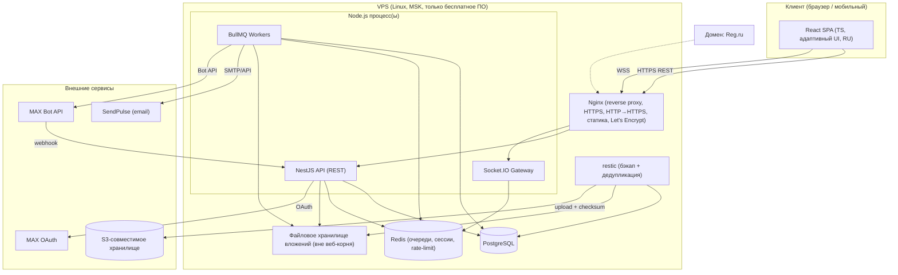
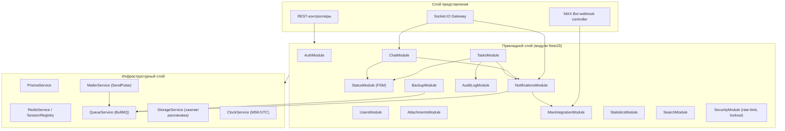
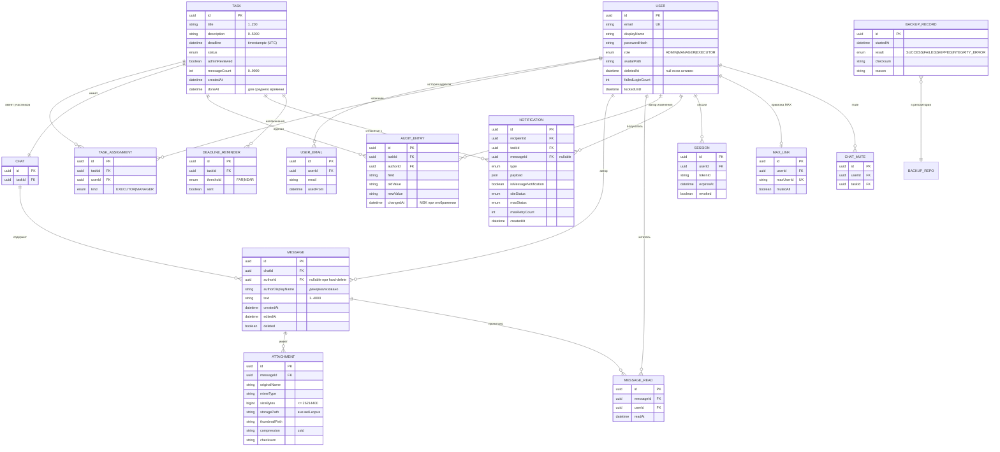
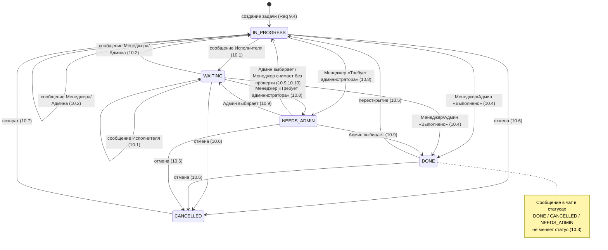
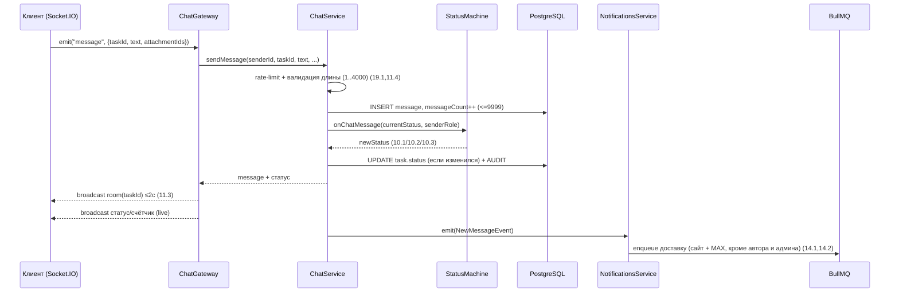
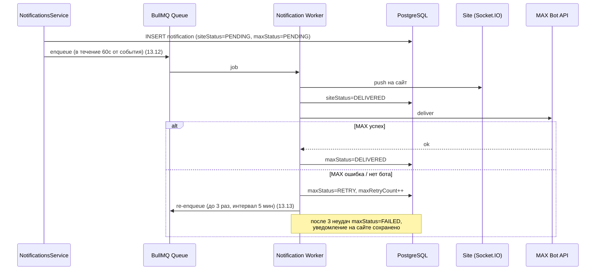
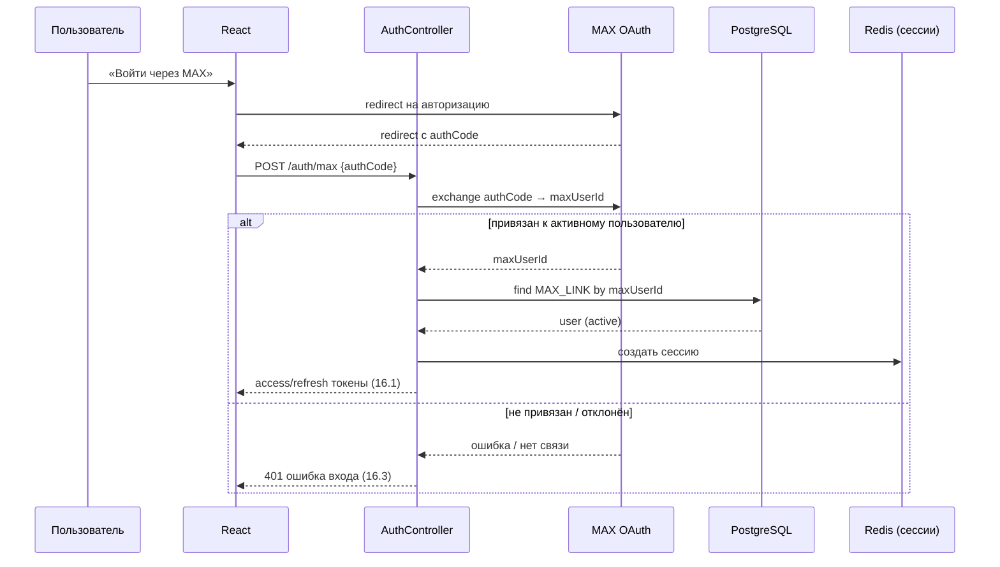

# Design Document

## Overview

«Система поручений» — это монолитное веб-приложение, развёртываемое на одном VPS, состоящее из серверной части на **Node.js + NestJS (TypeScript)**, клиентской части на **React (TypeScript)**, реляционного хранилища **PostgreSQL** и слоя фоновой обработки на **BullMQ + Redis**. Realtime-взаимодействие (чат, обновление статусов, счётчиков и доставка уведомлений на сайт) реализуется через **Socket.IO**. Внешние интеграции: **SendPulse** (email), **MAX** (OAuth-вход и Бот для уведомлений и управления задачами). Файлы-вложения хранятся в сжатом виде в файловой системе вне веб-корня, метаданные — в PostgreSQL. Резервное копирование выполняется инструментом с дедупликацией (**restic**) с выгрузкой в S3-совместимое хранилище.

Документ описывает архитектуру, модули NestJS, модель данных, конечный автомат статусов задач, ключевые потоки (отправка сообщения со сменой статуса, доставка уведомления с ретраями, OAuth MAX), стратегию обработки ошибок, набор свойств корректности (correctness properties) для property-based-тестирования и общую стратегию тестирования. Дизайн покрывает все 21 требование документа requirements.md.

### Ключевые архитектурные решения

| Решение | Выбор | Обоснование |
|---|---|---|
| ORM | **Prisma** | Декларативная схема (`schema.prisma`) как единый источник истины, строгая типизация на уровне TypeScript, удобные миграции, генерация типов. Для модели данной системы (фиксированный набор сущностей, нет сложных хранимых процедур) Prisma даёт более быстрый и безопасный цикл разработки, чем TypeORM. Для тяжёлой статистики (Req 17) при необходимости используем `prisma.$queryRaw` с параметризованными запросами. |
| Часовой пояс | Хранение в UTC, отображение/расчёт в MSK | Весь backend работает с UTC `timestamptz` в PostgreSQL; преобразование в MSK (UTC+3) выполняется в слое представления и при формировании строк формата `ДД.ММ.ГГГГ ЧЧ:ММ` (Req 1.2). Окна дедлайнов вычисляются в UTC. |
| Realtime | Socket.IO с комнатами (rooms) по `taskId` и по `userId` | Комната задачи — для чата и live-статусов; персональная комната пользователя — для уведомлений и аннулирования сессий ≤5с (Req 3.4, 8.6, 19.10). |
| Фоновые задачи | BullMQ (Redis) | Очереди для email-ретраев (Req 1.7), доставки/ретраев MAX-уведомлений (Req 13.13, 14.6), напоминаний о дедлайнах (Req 13.7–13.10), резервного копирования (Req 21). |
| Хранение вложений | Файловая система вне веб-корня + сжатие zstd | Поточное gzip/zstd-сжатие без потерь (Req 12.8), контролируемая отдача (Req 19.8), распаковка на клиенте (Req 12.9). |
| Аутентификация | JWT access + server-side refresh/session-реестр в Redis | Реестр сессий в Redis позволяет аннулировать токены ≤5с (Req 3.4, 8.6, 19.10) — access-токены короткоживущие, проверка валидности сессии при каждом запросе/socket-подключении. |

## Architecture

### Контекст развёртывания (один VPS)



Nginx терминирует TLS (сертификаты Let's Encrypt), перенаправляет весь HTTP на HTTPS с сохранением пути и query-параметров (Req 1.3, 1.4), проксирует REST и WebSocket, отдаёт собранную статику React. Вложения отдаются только через контролируемый эндпоинт NestJS (Req 19.8), а не напрямую Nginx из веб-корня.

### Слои приложения (компонентная диаграмма)



## Components and Interfaces

Ниже — модули NestJS, их зона ответственности и основные интерфейсы (TypeScript-сигнатуры приведены упрощённо).

### AuthModule
Регистрация по приглашению, установка пароля по одноразовой ссылке, вход по email+паролю, OAuth MAX, блокировка после неудачных попыток, выпуск/аннулирование сессий. (Req 5, 6.1, 6.7, 15.1–15.3, 16.1–16.3, 19.3–19.7, 19.10)

```typescript
interface AuthService {
  invite(adminId: string, email: string): Promise<User>;          // Req 5.1–5.4, 15.1
  setPassword(token: string, password: string): Promise<void>;    // Req 5.5, 5.6, 6.7, 19.5–19.7
  login(email: string, password: string, ip: string): Promise<Session>; // Req 5.7–5.10, 19.3,19.4
  loginWithMax(maxAuthCode: string): Promise<Session>;            // Req 16.1, 16.3
  changePassword(userId: string, current: string, next: string): Promise<void>; // Req 6.1, 6.7
  revokeAllSessions(userId: string): Promise<void>;               // Req 3.4, 8.6, 19.10 (≤5с)
}
```
- **Блокировка**: счётчик неудачных попыток на учётную запись в Redis; при достижении 5 — блокировка на 15 минут (Req 5.9, 19.3).
- **Одноразовая ссылка**: токен с TTL 24 ч, помечается использованным при первой установке пароля; повторное/просроченное использование отклоняется (Req 5.6, 19.5–19.7).
- **Реестр сессий**: каждая активная сессия имеет запись в Redis; `revokeAllSessions` удаляет их, а Gateway принудительно отключает сокеты пользователя — гарантия аннулирования ≤5с.

### UsersModule
CRUD пользователей, роли, единственный администратор, передача роли, удаление (2 режима), восстановление, история email, профиль/аватар, привязка MAX. (Req 2, 3, 4, 6, 7, 8)

```typescript
interface UsersService {
  createPrimaryAdmin(email: string): Promise<User>;               // Req 4 (через CLI)
  transferAdmin(currentAdminId: string, targetUserId: string): Promise<void>; // Req 3
  deleteUser(adminId: string, userId: string, mode: 'soft' | 'hard'): Promise<void>; // Req 8
  restoreUser(adminId: string, deletedUserId: string, email: string): Promise<User>; // Req 7
  updateProfile(actorId: string, userId: string, patch: ProfilePatch): Promise<User>; // Req 6
  setAvatar(actorId: string, userId: string, file: UploadedFile): Promise<void>; // Req 6.4,6.5,6.9
  linkMax(userId: string, maxProfile: MaxProfile): Promise<void>; // Req 6.6, 6.9, 16.2
}
```
- **Инвариант единственного администратора**: операции `transferAdmin`, `deleteUser`, `updateRole` выполняются в транзакции с проверкой «после операции ровно один администратор» (Req 2.2, 2.11, 3.3, 8.8).
- **Видимость задач** реализуется в `TasksModule`, но базируется на ролях из `UsersModule` (Req 2.8–2.10).
- **История email**: таблица `UserEmail` хранит ≥50 адресов на пользователя, включая прежние (Req 7.1).
- **Удаление**: soft — флаг `deletedAt`, запись остаётся (Req 8.2, 8.4); hard — удаление записи пользователя при сохранении его сообщений/вложений через денормализованное `authorDisplayName` (Req 8.3, 8.4). Перед удалением — переназначение задач, где пользователь единственный исполнитель/менеджер, в статус «Требует администратора» (Req 8.5).

### TasksModule
Создание задач, параметры и их валидация, назначения, счётчики сообщений/непрочитанного, изменение параметров с журналированием и уведомлениями. (Req 9, 10.12, 10.13, 20)

```typescript
interface TasksService {
  create(managerId: string, dto: CreateTaskDto): Promise<Task>;   // Req 9.1–9.5
  update(actorId: string, taskId: string, patch: TaskPatch): Promise<Task>; // Req 10.12,10.13,13.4,20
  assign(actorId: string, taskId: string, assignees: Assignment): Promise<Task>; // Req 2.4–2.7,13.2,13.3
  listVisible(userId: string, query: TaskQuery): Promise<Page<Task>>; // Req 2.8–2.10, 18
}
```
- При создании: статус «В работе», создаётся связанный чат (Req 9.4, 9.5).
- Счётчик сообщений ограничен диапазоном 0–9999; при ≥10000 фиксируется на 9999 (Req 9.7, 9.9).

### StatusModule (конечный автомат)
Чистая, изолированная логика переходов статусов; используется и при ручной смене статуса, и при авто-переключении из чата. (Req 10)

```typescript
type Status = 'IN_PROGRESS' | 'WAITING' | 'DONE' | 'NEEDS_ADMIN' | 'CANCELLED';
type Actor = 'EXECUTOR' | 'MANAGER' | 'ADMIN';

interface StatusMachine {
  // Авто-переход по сообщению в чат
  onChatMessage(current: Status, sender: Actor): Status;          // Req 10.1–10.3
  // Явный переход, инициированный пользователем
  transition(current: Status, action: StatusAction, actor: Actor, reviewedFlag: boolean):
    { status: Status } | { error: 'NO_PERMISSION' | 'INVALID_TRANSITION' }; // Req 10.4–10.10,10.14,10.15
}
```

### ChatModule
Realtime-чат, отправка/редактирование/удаление сообщений с правами, список прочитавших, раздел «Вложения», авто-переход статуса, mute. (Req 11, 14, 16.8, 16.9)

```typescript
interface ChatService {
  sendMessage(senderId: string, taskId: string, text: string, attachmentIds: string[]): Promise<Message>; // Req 11.3,11.4,11.9,10.1,10.2
  editMessage(actorId: string, messageId: string, text: string): Promise<Message>; // Req 11.5, 11.6
  deleteMessage(actorId: string, messageId: string): Promise<void>;  // Req 11.6, 11.7
  markRead(userId: string, messageId: string): Promise<void>;        // Req 11.8, 14.4
  listAttachments(userId: string, taskId: string): Promise<Attachment[]>; // Req 11.10
  setMute(userId: string, taskId: string, muted: boolean): Promise<void>; // Req 16.9
}
```
- Доставка сообщения подключённым участникам ≤2с через Socket.IO (Req 11.3).
- Права на редактирование/удаление: автор, менеджер задачи или администратор (Req 11.5–11.7).
- Удалённое сообщение заменяется меткой «Сообщение удалено» (Req 11.7); отредактированное помечается «изменено» с датой/временем (Req 11.5).

### AttachmentsModule
Загрузка файлов любых типов до 25 МБ, лимит 10 вложений на сообщение, миниатюры изображений, обобщённые значки, сжатое хранение с распаковкой без потерь. (Req 11.9, 12, 19.8, 19.9)

```typescript
interface AttachmentsService {
  upload(userId: string, taskId: string, file: UploadStream): Promise<Attachment>; // Req 12.1–12.5
  generateThumbnail(attachmentId: string): Promise<void>;          // Req 12.6, 12.7
  openCompressed(userId: string, attachmentId: string): Promise<CompressedStream>; // Req 12.8, 12.9, 19.8
}
```
- Проверка размера/типа и хранение вне веб-корня (Req 19.8); прерванная загрузка не сохраняет частичный файл (Req 12.4).
- Сжатие zstd при сохранении; отдача сжатого потока с распаковкой на клиенте (Req 12.8, 12.9).

### NotificationsModule
Формирование отдельных уведомлений по событиям, доставка по каналам (сайт/email/MAX), очистка уведомлений о сообщениях после просмотра, очереди и ретраи, настраиваемые пороги дедлайна. (Req 13, 14, 15)

```typescript
interface NotificationsService {
  emit(event: DomainEvent): Promise<void>;                          // Req 13.1,13.12 (постановка в очередь ≤60с)
  deliver(notification: Notification, channel: Channel): Promise<DeliveryResult>; // Req 13.13,14.6
  clearMessageNotification(userId: string, messageId: string): Promise<void>; // Req 14.4, 16.12
  scheduleDeadlineReminders(task: Task): Promise<void>;             // Req 13.7–13.10
}
interface ReminderThresholds { far: number; near: number; } // секунды; по умолчанию 86400 / 7200
```
- Каждое событие → отдельное уведомление, без дайджеста (Req 13.1).
- Доставка через очередь BullMQ; ретраи MAX до 3 раз с интервалом 5 минут (Req 13.13) либо 3 раза с интервалом 5/30 секунд для уведомлений о сообщениях/аккаунте (Req 14.6, 15.7); уведомление на сайте сохраняется независимо от MAX.
- Уведомления о сообщениях чата автоматически удаляются после просмотра в видимой области ≤3с на сайте и в MAX (Req 14.4); прочие типы не удаляются по просмотру (Req 14.5). Администратору уведомления о сообщениях чата не отправляются (Req 14.2).
- Пороги дедлайна настраиваемые (по умолчанию 24ч/2ч), окно проверки ±5 минут, защита от повторной отправки порога (Req 13.7–13.10).

### MaxIntegrationModule
OAuth MAX, Бот MAX (список задач, отправка сообщений и вложений, mute, отписки, удаление уведомлений после просмотра). (Req 16)

```typescript
interface MaxBotService {
  listTasks(maxUserId: string): Promise<TaskSummary[]>;             // Req 16.7 (видимость по Req 2)
  sendMessageFromBot(maxUserId: string, taskId: string, text: string, files: UploadStream[]): Promise<void>; // Req 16.8,16.10,16.11
  setMuteFromBot(maxUserId: string, taskId: string, muted: boolean): Promise<void>; // Req 16.9
  unsubscribeAll(maxUserId: string): Promise<void>;                 // Req 16.5
  unsubscribeTask(maxUserId: string, taskId: string): Promise<void>; // Req 16.6
  onMessageSeen(maxUserId: string, messageId: string): Promise<void>; // Req 16.12
}
```

### StatisticsModule
Подсчёт статистики по статусам, просрочкам, среднему времени выполнения, разрезам по участникам, активности чатов; фильтр по периоду; экспорт CSV/Excel. (Req 17)

```typescript
interface StatisticsService {
  compute(adminId: string, period?: DateRange): Promise<Statistics>; // Req 17.1–17.8 (≤5с)
  export(adminId: string, period: DateRange, format: 'csv' | 'xlsx'): Promise<FileStream>; // Req 17.9,17.10 (≤10с)
}
```

### SearchModule
Поиск по подстроке (регистронезависимо) в названии/описании, фильтрация (логическое И), пагинация (по умолчанию 20, макс 100). (Req 18)

```typescript
interface SearchService {
  search(userId: string, q: SearchQuery): Promise<Page<Task>>; // Req 18.1–18.7
}
interface SearchQuery { text?: string; filters?: TaskFilters; page?: number; pageSize?: number; }
```

### AuditLogModule
Неизменяемый журнал изменений задач: автор, параметр, прежнее/новое значение, время MSK; доступ менеджеру задачи и администратору; запрет правки/удаления. (Req 20)

```typescript
interface AuditLogService {
  record(entry: AuditEntryInput): Promise<void>;     // Req 20.1, 20.4 (append-only)
  list(actorId: string, taskId: string): Promise<AuditEntry[]>; // Req 20.2, 20.3 (новые→старые)
}
```

### BackupModule
Ежедневный бэкап 03:00 MSK инструментом restic (дедупликация/сжатие/инкрементальность), GFS-политика, выгрузка в S3, проверка целостности по контрольной сумме, пропуск при превышении 60 минут. (Req 21)

```typescript
interface BackupService {
  runDailyBackup(): Promise<BackupResult>; // Req 21.2,21.4,21.6,21.8
  applyRetention(): Promise<void>;         // Req 21.3 (GFS 7/4/6)
  verifyIntegrity(backupId: string): Promise<boolean>; // Req 21.6, 21.7
}
```

### SecurityModule
Rate limiting (не более 10 запросов с источника за скользящее окно 60с) на чувствительные операции, блокировка после неудачных входов, контроль загрузок. (Req 19)

```typescript
interface RateLimiter {
  check(source: string, op: SensitiveOp): Promise<{ allowed: boolean }>; // Req 19.1, 19.2
}
type SensitiveOp = 'login' | 'set_password' | 'change_password' | 'send_message' | 'upload';
```

### ClockService
Единая точка получения времени; преобразование UTC↔MSK; форматирование `ДД.ММ.ГГГГ ЧЧ:ММ`. Инъецируется для тестируемости (детерминированное «сейчас»). (Req 1.2)

## Data Models

### ER-диаграмма



### Конечный автомат статусов задачи (Req 10)



### Ключевые потоки (sequence-диаграммы)

#### 1. Отправка сообщения со сменой статуса (Req 11.3, 10.1/10.2, 14.1)



#### 2. Доставка уведомления с ретраями (Req 13.12, 13.13, 14.6)



#### 3. Вход через OAuth MAX (Req 16.1, 16.3)




## Correctness Properties

*Свойство (property) — это характеристика или поведение, которое должно выполняться для всех допустимых исполнений системы; по сути, формальное утверждение о том, что система обязана делать. Свойства служат мостом между человекочитаемой спецификацией и машинно-проверяемыми гарантиями корректности.*

Свойства ниже получены из prework-анализа: близкие и логически вложенные критерии объединены, чтобы каждое свойство несло уникальную проверочную ценность. Все свойства универсально квантифицированы и предназначены для property-based-тестирования (минимум 100 итераций на свойство).

### Property 1: Форматирование времени в MSK и round-trip

*Для любого* момента времени (UTC) форматирование в MSK даёт строку вида `ДД.ММ.ГГГГ ЧЧ:ММ`, соответствующую UTC+3, и обратный разбор этой строки восстанавливает исходный момент с точностью до минуты.

**Validates: Requirements 1.2**

### Property 2: HTTP→HTTPS сохраняет путь и параметры

*Для любого* входного URL по HTTP с произвольными путём и query-параметрами построенный redirect-URL использует HTTPS и сохраняет тот же путь и те же query-параметры.

**Validates: Requirements 1.3, 1.4**

### Property 3: Число попыток внешней доставки ограничено

*Для любой* последовательности сбоев внешнего провайдера (email или MAX) количество попыток доставки одного сообщения/уведомления не превышает 3, и при окончательной неудаче элемент остаётся в очереди/сохранён, а факт неудачи зафиксирован.

**Validates: Requirements 1.7, 13.13, 14.6, 14.7, 15.4, 15.7**

### Property 4: Инвариант единственного администратора

*Для любой* последовательности допустимых операций над пользователями (создание, смена роли, передача роли администратора, удаление) число администраторов в системе остаётся ровно равным 1; любая операция, которая привела бы к нулю или более чем одному администратору, отклоняется и оставляет роли без изменений.

**Validates: Requirements 2.2, 2.11, 3.1, 3.3, 4.4, 8.8**

### Property 5: Администратор обладает надмножеством прав менеджера

*Для любого* действия, разрешённого менеджеру в заданном контексте, это же действие разрешено и администратору.

**Validates: Requirements 2.3**

### Property 6: Видимость задач по роли и назначениям

*Для любого* набора задач и любого пользователя список видимых задач равен: для исполнителя — ровно задачам, где он исполнитель; для менеджера — ровно задачам, где он менеджер; для администратора — всем задачам. То же множество возвращает список задач Бота MAX.

**Validates: Requirements 2.8, 2.9, 2.10, 16.7**

### Property 7: Отказ в доступе к чужой задаче не раскрывает содержимое

*Для любого* пользователя и любой задачи, к которой у него нет прав по роли и назначениям, запрос отклоняется и не возвращает содержимое задачи.

**Validates: Requirements 2.12**

### Property 8: Правила назначения исполнителей

*Для любой* задачи и любых актора и кандидата: назначение менеджера исполнителем разрешено только администратору; попытка менеджера назначить менеджера исполнителем отклоняется и оставляет состав исполнителей без изменений; менеджер, назначенный исполнителем, получает права исполнителя и не может редактировать эту задачу.

**Validates: Requirements 2.4, 2.5, 2.6, 2.7**

### Property 9: Аннулирование сессий делает токены невалидными

*Для любого* набора активных сессий пользователя после аннулирования (при удалении пользователя или передаче роли администратора) все его сессии/токены становятся невалидными, и последующие запросы с ними отклоняются.

**Validates: Requirements 3.4, 8.6, 8.7, 19.10**

### Property 10: Сохранность операции при сбое уведомления

*Для любой* передачи роли администратора, завершившейся сменой ролей, последующий сбой отправки email не откатывает смену ролей, а лишь фиксирует признак неуспешной отправки.

**Validates: Requirements 3.6**

### Property 11: Валидация адреса электронной почты при создании администратора

*Для любой* строки длиной вне диапазона 6–254 или не соответствующей формату email команда создания первичного администратора отклоняется и администратор не создаётся; для корректного email при отсутствии существующего администратора создаётся ровно один администратор.

**Validates: Requirements 4.1, 4.3**

### Property 12: Жизненный цикл одноразовой ссылки установки пароля

*Для любой* ссылки установки пароля: она валидна тогда и только тогда, когда текущий момент не превышает момент выпуска плюс 24 часа (86400 с) и она ещё не была использована; после успешного использования или истечения срока повторная установка пароля отклоняется.

**Validates: Requirements 5.6, 15.2, 15.3, 19.5, 19.6, 19.7**

### Property 13: Активация учётной записи

*Для любой* учётной записи: она активируется тогда и только тогда, когда пользователь установил пароль по действующей ссылке; до успешной отправки регистрационного письма учётная запись остаётся неактивной.

**Validates: Requirements 5.4, 5.5**

### Property 14: Блокировка после неудачных попыток входа

*Для любой* последовательности попыток входа, при достижении 5 последовательных неудач вход в учётную запись блокируется на 15 минут, и пока блокировка активна любая попытка входа (даже с верными данными) отклоняется с сообщением о временной блокировке.

**Validates: Requirements 5.9, 5.10, 19.3, 19.4**

### Property 15: Аутентификация по email и паролю

*Для любой* комбинации email/пароль: сессия выдаётся тогда и только тогда, когда комбинация верна, учётная запись активирована и не заблокирована; при неверной комбинации вход отклоняется, данные не меняются, а сообщение об ошибке не указывает, какое именно поле некорректно.

**Validates: Requirements 5.7, 5.8**

### Property 16: Права изменения учётных данных и валидация

*Для любого* актора, целевого пользователя и поля профиля: пароль может менять только сам пользователь при верном текущем пароле; email и имя — только администратор; аватар — сам пользователь или администратор; любая попытка изменить неразрешённое поле отклоняется и оставляет данные без изменений. Новый пароль принимается тогда и только тогда, когда его длина в диапазоне 8–128 и он не совпадает с текущим.

**Validates: Requirements 6.1, 6.2, 6.3, 6.7, 6.8**

### Property 17: Валидация аватара и привязки MAX

*Для любого* загружаемого аватара или попытки привязки профиля MAX: операция отклоняется и ранее сохранённые данные профиля не меняются, если аватар превышает 5 МБ либо имеет неподдерживаемый формат, либо профиль MAX чужой или привязка не удалась.

**Validates: Requirements 6.4, 6.5, 6.6, 6.9**

### Property 18: История адресов электронной почты не теряется

*Для любой* последовательности изменений email пользователя сохранённая история адресов только растёт (прежние адреса не удаляются) и вмещает не менее 50 адресов.

**Validates: Requirements 7.1**

### Property 19: Восстановление удалённого пользователя

*Для любого* удалённого пользователя и выбранного сохранённого email: восстановление создаёт активную учётную запись по этому email; если email уже занят активной учётной записью, восстановление отклоняется и данные удалённого пользователя не меняются.

**Validates: Requirements 7.2, 7.5**

### Property 20: Сохранность сообщений и отображаемого имени при удалении пользователя

*Для любого* пользователя после удаления (в любом режиме) все его сообщения и вложения сохраняются неизменными, а его отображаемое имя остаётся таким, каким было на момент удаления, без обезличивания; при soft-удалении запись пользователя остаётся помеченной удалённой, при hard-удалении запись пользователя отсутствует.

**Validates: Requirements 8.2, 8.3, 8.4**

### Property 21: Переназначение осиротевших задач при удалении

*Для любого* удаляемого пользователя каждая задача, в которой он был единственным исполнителем или единственным менеджером, после удаления имеет статус «Требует администратора»; ни одна задача не остаётся без исполнителя или без менеджера в активном статусе.

**Validates: Requirements 8.5**

### Property 22: Валидация параметров задачи при создании

*Для любого* набора параметров задача создаётся тогда и только тогда, когда все обязательные параметры присутствуют и в границах (Название 1–200, Описание 0–5000, Дедлайн задан, Исполнители 1–100, Менеджеры 1–100); при нарушении границ создание отклоняется, возвращается ошибка с указанием параметра, а ранее введённые значения сохраняются.

**Validates: Requirements 9.1, 9.2, 9.3**

### Property 23: Начальное состояние созданной задачи

*Для любой* успешно созданной задачи её статус равен «В работе», и с ней связан ровно один чат.

**Validates: Requirements 9.4, 9.5**

### Property 24: Насыщение счётчика сообщений

*Для любого* числа сообщений в чате отображаемый счётчик равен min(число_сообщений, 9999) и всегда находится в диапазоне 0–9999; при 10000 и более он фиксируется на 9999.

**Validates: Requirements 9.7, 9.9**

### Property 25: Маркер непрочитанных сообщений

*Для любого* пользователя и чата маркер непрочитанного отображается на карточке задачи тогда и только тогда, когда в чате есть хотя бы одно сообщение, не отмеченное прочитанным этим пользователем.

**Validates: Requirements 9.8**

### Property 26: Корректность валидных переходов конечного автомата

*Для любого* текущего статуса, актора и допустимого действия (включая авто-переход по сообщению в чат) конечный автомат возвращает статус согласно правилам: сообщение исполнителя в «В работе»/«Ожидает» → «Ожидает»; сообщение менеджера/администратора → «В работе»; «Выполнено»/переоткрытие/отмена/возврат/«Требует администратора»/снятие — в точности по таблице переходов.

**Validates: Requirements 10.1, 10.2, 10.4, 10.5, 10.6, 10.7, 10.8, 10.9, 10.10**

### Property 27: Стабильность статуса при недопустимых, неавторизованных и нейтральных событиях

*Для любого* текущего статуса статус остаётся неизменным, если: сообщение приходит в статусе «Выполнено»/«Отменено»/«Требует администратора»; наступает дедлайн; изменяются параметры задачи; пользователь без прав пытается сменить статус; запрашивается переход, недопустимый из текущего статуса. В случаях нарушения прав/недопустимого перехода возвращается соответствующая ошибка.

**Validates: Requirements 10.3, 10.11, 10.12, 10.14, 10.15**

### Property 28: Участники чата

*Для любой* задачи множество участников чата равно объединению её исполнителей, её менеджеров и администратора.

**Validates: Requirements 11.2**

### Property 29: Валидация длины текста сообщения

*Для любого* текста сообщение сохраняется тогда и только тогда, когда длина текста в диапазоне 1–4000; пустой текст или длина более 4000 отклоняются без сохранения изменений. Это правило действует и при создании, и при редактировании.

**Validates: Requirements 11.3, 11.4, 11.5**

### Property 30: Права на редактирование и удаление сообщения

*Для любого* сообщения и любого актора: редактирование/удаление разрешено тогда и только тогда, когда актор — автор сообщения, менеджер задачи или администратор; иначе операция отклоняется и сообщение не меняется. После редактирования отображается метка «изменено» с датой/временем, после удаления — метка «Сообщение удалено».

**Validates: Requirements 11.5, 11.6, 11.7**

### Property 31: Список прочитавших сообщение

*Для любого* сообщения отображаемый список прочитавших равен в точности множеству участников чата, отметивших это сообщение прочитанным.

**Validates: Requirements 11.8**

### Property 32: Лимиты вложений по размеру и количеству

*Для любого* загружаемого файла и любого сообщения: загрузка разрешена тогда и только тогда, когда размер файла не превышает 25 МБ и число вложений в сообщении не превышает 10; иначе загрузка/отправка отклоняется и вложение не сохраняется. Правило едино для веб-интерфейса и Бота MAX.

**Validates: Requirements 11.9, 12.1, 12.2, 12.3, 16.10, 16.11, 19.8, 19.9**

### Property 33: Полнота раздела «Вложения»

*Для любого* чата множество вложений, показываемых в разделе «Вложения», равно множеству всех вложений всех сообщений этого чата.

**Validates: Requirements 11.10**

### Property 34: Выбор представления вложения по типу

*Для любого* вложения: если это изображение в пределах лимита — формируется миниатюра; если тип не поддерживает превью — выбирается обобщённый значок, соответствующий типу файла.

**Validates: Requirements 12.5, 12.6, 12.7**

### Property 35: Сжатие вложений без потери данных (round-trip)

*Для любой* последовательности байтов файла распаковка сжатого представления восстанавливает исходные байты в точности: `decompress(compress(file)) == file`.

**Validates: Requirements 12.8, 12.9**

### Property 36: Одно событие — отдельные уведомления получателям

*Для любого* доменного события, требующего уведомления, создаётся по одному отдельному уведомлению на каждого получателя (без объединения событий в дайджест); число созданных уведомлений равно числу получателей события.

**Validates: Requirements 13.1**

### Property 37: События задачи порождают уведомления нужным получателям

*Для любого* события из набора {назначение, снятие, изменение Названия/Описания/Дедлайна, изменение статуса, переоткрытие/отмена/возврат} создаются уведомления (сайт + MAX) для затронутых исполнителей и менеджеров задачи; уведомления о статусе содержат новый статус.

**Validates: Requirements 13.2, 13.3, 13.4, 13.6, 13.11**

### Property 38: Отсутствие уведомлений для исключённых событий

*Для любого* события изменения состава участников, а также изменения профиля администратором, удаления аккаунта, изменения или удаления сообщения — соответствующие уведомления не создаются и не отправляются.

**Validates: Requirements 13.5, 14.3, 15.9, 15.10**

### Property 39: Логика порогов напоминаний о дедлайне

*Для любой* задачи и настраиваемых порогов (по умолчанию дальний 24 ч, ближний 2 ч, окно ±5 мин): порог отправляется тогда и только тогда, когда оставшееся до дедлайна время попадает в окно порога и этот порог ещё не отправлялся; при создании/изменении дедлайна, если остаток между порогами — немедленно отправляется только дальний, если остаток меньше ближнего — только ближний. Каждый порог отправляется не более одного раза.

**Validates: Requirements 13.7, 13.8, 13.9, 13.10**

### Property 40: Получатели уведомления о новом сообщении чата

*Для любого* нового сообщения чата уведомление о нём создаётся ровно для участников чата за исключением автора сообщения и администратора.

**Validates: Requirements 14.1, 14.2**

### Property 41: Очистка уведомлений о сообщениях после просмотра и сохранность прочих

*Для любого* пользователя: после отметки сообщения просмотренным (на сайте или в Боте MAX) соответствующее уведомление о сообщении удаляется по всем каналам; уведомления любых иных типов при просмотре не удаляются.

**Validates: Requirements 14.4, 14.5, 16.12**

### Property 42: Независимость доставки на сайт от канала MAX

*Для любого* уведомления доставка/сохранение на сайте выполняется независимо от результата доставки в MAX; действия пользователя в Боте MAX (отписки, mute, просмотр) не изменяют состояние уведомлений на сайте, кроме случаев, прямо предусмотренных правилами очистки.

**Validates: Requirements 14.6, 14.7, 15.7, 16.13**

### Property 43: Уведомления о смене роли менеджера

*Для любого* события назначения или снятия роли менеджера создаётся уведомление пользователю на сайте и через Бот MAX.

**Validates: Requirements 15.5, 15.6**

### Property 44: Вход через OAuth MAX

*Для любого* результата OAuth MAX: сессия выдаётся тогда и только тогда, когда учётная запись MAX привязана к активному пользователю и авторизация на стороне MAX успешна; иначе вход отклоняется и пользователь остаётся неаутентифицированным. Привязка MAX не заменяет регистрацию администратором.

**Validates: Requirements 5.11, 16.1, 16.2, 16.3**

### Property 45: Фильтрация доставки MAX по отпискам и mute

*Для любого* пользователя и задачи: при включённой отписке от всех уведомлений ни одно MAX-уведомление не доставляется; при отписке/mute конкретной задачи не доставляются MAX-уведомления этой задачи; повторное включение (unmute) восстанавливает доставку (round-trip).

**Validates: Requirements 16.5, 16.6, 16.9**

### Property 46: Согласованность статистики по статусам

*Для любого* набора видимых задач статистика по статусам содержит все существующие статусы (включая нулевые), а сумма количеств по статусам равна общему числу задач.

**Validates: Requirements 17.1**

### Property 47: Классификация просроченных задач и доля

*Для любого* набора задач задача классифицируется как просроченная тогда и только тогда, когда текущее время превышает её дедлайн и она не в статусе «Выполнено»; отображаемая доля просроченных равна (число просроченных / общее число) × 100, округлённой до одного знака.

**Validates: Requirements 17.2**

### Property 48: Среднее время выполнения

*Для любого* набора задач среднее время выполнения равно среднему арифметическому интервалов (doneAt − createdAt) по всем выполненным задачам, выраженному в часах и округлённому до одного знака; при отсутствии выполненных задач значение равно 0.

**Validates: Requirements 17.3**

### Property 49: Статистика по участникам и активности чатов

*Для любого* набора задач и сообщений количество задач в разрезе каждого менеджера/исполнителя согласовано с фактическими назначениями, а показатели активности чатов равны числу отправленных сообщений и числу чатов, содержащих не менее одного сообщения.

**Validates: Requirements 17.4, 17.5**

### Property 50: Фильтрация статистики по периоду и валидация диапазона

*Для любого* периода [начало, конец] статистика рассчитывается только по задачам и сообщениям, попадающим в период включительно; если начало позже конца, запрос отклоняется с ошибкой, а ранее отображённая статистика не меняется.

**Validates: Requirements 17.6, 17.7**

### Property 51: Полнота экспортируемого файла статистики

*Для любого* набора отображаемых показателей экспортируемый файл (CSV или Excel) содержит все эти показатели за выбранный период.

**Validates: Requirements 17.9**

### Property 52: Корректность поиска по подстроке

*Для любой* строки запроса длиной 1–256 множество результатов поиска равно множеству видимых пользователю задач, у которых строка запроса встречается как подстрока без учёта регистра в Названии или Описании (полнота и точность); пустой запрос или длина более 256 отклоняются с ошибкой и не изменяют текущий список.

**Validates: Requirements 18.1, 18.2**

### Property 53: Корректность фильтрации (логическое И)

*Для любого* набора фильтров по Статусу/Дедлайну/участникам каждый результат удовлетворяет одновременно всем выбранным условиям и находится в пределах видимости пользователя; недопустимое значение любого фильтра отклоняет запрос целиком без изменения текущего списка.

**Validates: Requirements 18.3, 18.4, 18.7**

### Property 54: Пагинация

*Для любого* запроса списка задач размер возвращаемой страницы не превышает min(запрошенный_размер, 100), при отсутствии указанного размера используется 20; запрос страницы за пределами доступных возвращает пустой список и корректное общее число найденных задач.

**Validates: Requirements 18.5, 18.6**

### Property 55: Ограничение частоты запросов (скользящее окно)

*Для любого* источника и любой последовательности чувствительных операций (вход, установка/смена пароля, отправка сообщения, загрузка файла) в скользящем окне 60 секунд первые 10 запросов допускаются, а все избыточные (11-й и далее) отклоняются с ошибкой превышения частоты, независимо от типа операции.

**Validates: Requirements 19.1, 19.2**

### Property 56: Журнал изменений — корректная запись на каждое изменение

*Для любого* изменения параметра (Название, Описание, Дедлайн, Исполнители, Менеджеры) или статуса задачи создаётся ровно одна запись журнала с автором, наименованием параметра, прежним и новым значением и временем изменения в MSK.

**Validates: Requirements 20.1**

### Property 57: Журнал изменений — порядок и права просмотра

*Для любой* задачи при просмотре журнала менеджером задачи или администратором возвращаются все записи этой задачи, упорядоченные по времени изменения от новых к старым; пользователю без прав доступ отклоняется.

**Validates: Requirements 20.2, 20.3**

### Property 58: Неизменяемость журнала (append-only)

*Для любой* последовательности операций множество записей журнала только растёт: ранее созданные записи не изменяются и не удаляются, и в системе отсутствуют операции их правки или удаления.

**Validates: Requirements 20.4**

### Property 59: GFS-политика хранения резервных копий

*Для любого* набора резервных копий после применения политики хранения остаётся не более 7 ежедневных, 4 еженедельных и 6 ежемесячных копий, и сохраняются именно те копии, которые соответствуют каждой квоте (самые свежие в своей категории); копии за пределами квот удаляются.

**Validates: Requirements 21.3**

### Property 60: Целостность резервной копии по контрольной сумме

*Для любой* резервной копии контрольная сумма, вычисленная после выгрузки в S3, сверяется с суммой до выгрузки; при совпадении копия считается действительной, при несоответствии — помечается недействительной с регистрацией события.

**Validates: Requirements 21.6, 21.7**

### Property 61: Сохранность последней успешной копии при сбое или пропуске

*Для любого* запуска резервного копирования, завершившегося сбоем дампа/выгрузки или пропущенного из-за превышения лимита 60 минут, последняя успешная резервная копия остаётся без изменений, а событие сбоя/пропуска регистрируется с указанием причины.

**Validates: Requirements 21.5, 21.8**


## Error Handling

### Принципы

- **Единый формат ошибок API**: все ответы об ошибке возвращают структуру `{ code, message, details? }`, где `message` — локализованный русский текст (Req 1.1). Коды стабильны и независимы от языка.
- **Семантические HTTP-коды**: `400` — нарушение валидации/границ; `401` — не аутентифицирован/невалидный токен; `403` — нет прав/доступа; `404` — ресурс недоступен в пределах видимости (без раскрытия существования чужой задачи, Req 2.12); `409` — конфликт (например, занятый email при восстановлении, Req 7.5); `422` — недопустимый переход статуса (Req 10.15); `429` — превышение частоты запросов (Req 19.2).
- **Неизменность при отказе**: для всех операций, где требования предписывают «сохранить данные без изменений» (Req 2.6, 3.2, 6.7–6.9, 7.5, 9.3, 10.14, 10.15, 11.4, 11.6, 17.7, 18.2, 18.4, 18.7), обработчик не выполняет частичных изменений — операции с несколькими записями выполняются в транзакции Prisma, откатываемой при любой ошибке.

### Категории ошибок и обработка

| Категория | Примеры требований | Стратегия |
|---|---|---|
| Валидация ввода | 4.3, 6.7, 9.3, 11.4, 12.3, 18.2 | DTO-валидация (class-validator) на границе контроллера; отказ до изменения состояния. |
| Авторизация/права | 2.6, 2.12, 6.8, 10.14, 11.6, 20.3 | Guards/Policy-слой; единый `403`/`404` без раскрытия данных. |
| Конфликты состояния | 4.4, 7.5, 8.8, 10.15 | Проверка инвариантов в транзакции; `409`/`422`. |
| Сбои внешних сервисов | 1.7, 3.5, 5.3, 13.13, 14.6, 15.4 | Ретраи через BullMQ с ограничением попыток (≤3), фиксация статуса доставки, сохранение на сайте независимо от MAX. |
| Сбои загрузки файлов | 12.3, 12.4, 19.9 | Потоковая проверка размера/типа; при прерывании — удаление частичного файла (без сохранения). |
| Сбои фоновых задач | 21.5, 21.7, 21.8 | Регистрация события с причиной; сохранение последней успешной копии; пометка недействительной при нарушении целостности. |
| Деградация UI | 1.8 | Перекрытие элементов трактуется как визуальная деградация, не прерывает работу. |

### Стратегия ретраев (BullMQ)

- **Email (SendPulse)**: до 3 попыток; при недоступности/таймауте 30 с — сообщение остаётся в очереди, фиксируется неуспешная доставка (Req 1.7, 5.4, 15.4).
- **MAX-уведомления (задачи)**: до 3 ретраев с интервалом 5 минут (Req 13.13).
- **MAX-уведомления (сообщения чата и аккаунт)**: до 3 ретраев с интервалом 5 с / 30 с по соответствующим требованиям (Req 14.6, 15.7); уведомление на сайте сохраняется независимо.
- **Удаление уведомления в MAX**: при неудаче — удаление на сайте и фиксация признака для повторной попытки (Req 14.7).
- Идемпотентность задач очереди обеспечивается ключами событий, чтобы повтор не создавал дублей уведомлений.

## Testing Strategy

Применяется двойной подход: **property-based-тесты** для универсальных свойств и **модульные (unit) / интеграционные тесты** для конкретных примеров, граничных случаев и внешних взаимодействий.

### Применимость property-based-тестирования

PBT применимо и ценно для данной системы, потому что значительная часть логики — это чистые функции и детерминированные правила с большим пространством входных данных:
- конечный автомат статусов (Req 10);
- правила прав и видимости (Req 2, 6, 11.6, 20.3);
- инвариант единственного администратора (Req 2, 3, 8);
- валидация границ (Req 4, 6, 9, 11, 12, 18);
- логика порогов напоминаний (Req 13.7–13.10);
- маршрутизация/фильтрация доставки уведомлений (Req 13, 14, 16);
- поиск/фильтрация/пагинация (Req 18);
- расчёт статистики (Req 17);
- round-trip сжатия вложений (Req 12.8/12.9) и форматирования времени (Req 1.2);
- политика хранения и целостность бэкапов (Req 21.3, 21.6).

PBT **не** применяется к: вёрстке/адаптивности (Req 1.5, 1.8), конфигурации HTTPS/Nginx (Req 1.3), расписанию и работе внешнего инструмента бэкапа (Req 21.1, 21.2, 21.4), доставке через реальные SendPulse/MAX и таймингам сетевой доставки (Req 1.6, 3.5, 5.3, 13.12, 15.1, 15.8, 16.4) — здесь используются smoke- и интеграционные тесты.

### Инструменты

- **Backend (TypeScript)**: тест-раннер **Jest** + property-based библиотека **fast-check** (НЕ реализуем PBT с нуля). Внешние границы (PostgreSQL, Redis, SendPulse, MAX, S3, файловое I/O) подменяются моками/инъекцией для удержания низкой стоимости 100+ итераций; `ClockService` инъецируется для детерминированного времени.
- **Frontend (React, TypeScript)**: Jest + React Testing Library для UI-поведения; чистые клиентские функции (распаковка вложений Req 12.9, форматирование MSK) — fast-check.
- **Интеграционные**: тестовая PostgreSQL и Redis (docker), 1–3 представительных примера на каждый интеграционный критерий.

### Конфигурация property-тестов

- Минимум **100 итераций** на каждое property-based-свойство.
- Каждый property-тест реализует ровно одно свойство из раздела Correctness Properties и помечается комментарием-тегом в формате:
  `**Feature: task-assignment-system, Property {number}: {property_text}**`
- Граничные случаи из prework (Req 7.6, 9.9, 12.4, 17.8, 17.10, 18.6) включаются в генераторы соответствующих свойств либо покрываются отдельными unit-тестами.

### Распределение тестов по типам

| Тип теста | Покрываемые требования (примеры) |
|---|---|
| Property-based (fast-check, ≥100 итераций) | Свойства 1–61 (см. Correctness Properties) |
| Unit (примеры/edge) | 2.1, 4.2, 4.4, 5.2, 7.3, 7.6, 8.1, 8.9, 8.10, 9.6, 9.9, 11.1, 16.2, 16.8, 17.8, 17.10, 18.6 |
| Интеграционные | 1.6, 3.5, 5.3, 10.13, 11.3, 13.12, 15.1, 15.8, 16.4, 21.2, 21.4 |
| Smoke / конфигурация | 1.1, 1.3, 1.5, 1.8, 19.8 (расположение файлов вне веб-корня), 21.1 |

### Связь свойств с реализацией

Каждое свойство привязано к конкретному модулю и тестируемой единице:
- Свойства 26–27 → `StatusModule.StatusMachine` (чистые функции, идеальны для PBT).
- Свойства 4, 5, 6, 7, 8, 16, 30, 57 → `UsersModule`/`TasksModule`/`AuditLogModule` (policy-слой на моках репозиториев).
- Свойства 39, 40, 41, 42, 45 → `NotificationsModule` (маршрутизация на моках каналов).
- Свойства 46–51 → `StatisticsModule` (чистые агрегатные функции над сгенерированными наборами).
- Свойства 52–54 → `SearchModule`.
- Свойство 35 → `StorageService` (round-trip сжатия над произвольными байтами).
- Свойства 59–61 → `BackupModule` (политика и проверка целостности на моках S3).
