# Implementation Plan: Система поручений

## Overview

План реализации монолитного приложения «Система поручений» на стеке NestJS + TypeScript (backend), PostgreSQL + Prisma, Socket.IO, BullMQ + Redis, React + TypeScript (frontend), с интеграциями SendPulse, MAX (OAuth + Бот), Nginx/Let's Encrypt и резервным копированием restic + S3.

Задачи организованы инкрементально: от каркаса проекта и инфраструктуры → к модели данных → авторизации и пользователям → задачам и конечному автомату статусов → чату → вложениям → уведомлениям → интеграции с MAX → статистике → поиску → журналу изменений → безопасности → резервному копированию → фронтенду → финальной интеграции.

Property-based-тесты реализуются на **fast-check** (Jest), минимум **100 итераций** на свойство; каждый такой тест помечается комментарием `**Feature: task-assignment-system, Property {N}: {текст}**` и реализует ровно одно свойство из раздела Correctness Properties дизайна. Тестовые подзадачи помечены `*` (необязательные/могут быть отложены для MVP), но обязательны для корректности.

## Tasks

- [x] 1. Каркас проекта и инфраструктурный слой
  - [x] 1.1 Инициализировать монорепозиторий и backend-приложение NestJS
    - Создать структуру каталогов: `backend/` (NestJS), `frontend/` (React), `prisma/`
    - Настроить TypeScript (strict), ESLint/Prettier, корневой `AppModule`
    - Подключить Jest и fast-check, добавить npm-скрипты `test`, `test:unit`, `test:e2e`
    - Создать модуль конфигурации (env): БД, Redis, SendPulse, MAX, S3, пороги напоминаний, лимиты
    - _Requirements: 1.1_

  - [x] 1.2 Описать Prisma-схему и сгенерировать миграции
    - Описать `schema.prisma` со всеми сущностями: User, UserEmail, Task, TaskAssignment, Chat, Message, Attachment, MessageRead, AuditEntry, Notification, Session, MaxLink, ChatMute, DeadlineReminder, BackupRecord
    - Задать перечисления (role, status, assignment kind, notification type/status, threshold, backup result), ограничения уникальности и индексы
    - Сгенерировать первичную миграцию и Prisma Client
    - _Requirements: 9.1, 7.1, 8.2, 8.3_

  - [x] 1.3 Реализовать PrismaService, RedisService и QueueService
    - `PrismaService` с управлением подключением и хелпером транзакций
    - `RedisService` (подключение, базовые операции) и реестр сессий (SessionRegistry)
    - `QueueService` поверх BullMQ: фабрика очередей email/MAX-уведомлений/напоминаний/бэкапа
    - _Requirements: 1.7, 13.12_

  - [x] 1.4 Реализовать ClockService (UTC↔MSK, форматирование)
    - Инъецируемый сервис «текущего времени», преобразование UTC↔MSK (UTC+3)
    - Функции `formatMsk(date): string` (`ДД.ММ.ГГГГ ЧЧ:ММ`) и `parseMsk(str): Date`
    - _Requirements: 1.2_

  - [x]* 1.5 Property-тест форматирования времени MSK и round-trip
    - **Property 1: Форматирование времени в MSK и round-trip**
    - **Validates: Requirements 1.2**

  - [x] 1.6 Реализовать модуль перенаправления HTTP→HTTPS
    - Чистая функция построения redirect-URL (HTTPS, сохранение пути и query) для использования в middleware/конфиге
    - Зарегистрировать middleware/guard перенаправления
    - _Requirements: 1.3, 1.4_

  - [x]* 1.7 Property-тест перенаправления HTTP→HTTPS
    - **Property 2: HTTP→HTTPS сохраняет путь и параметры**
    - **Validates: Requirements 1.3, 1.4**

  - [x] 1.8 Реализовать MailerService (SendPulse) с очередью и ретраями
    - Адаптер SendPulse, постановка писем в очередь BullMQ, ≤3 попыток, фиксация неуспешной доставки, сохранение в очереди
    - _Requirements: 1.6, 1.7_

- [x] 2. Базовая модель данных и общий слой ошибок
  - [x] 2.1 Реализовать единый формат ошибок и фильтр исключений
    - Структура `{ code, message, details? }`, локализованные русские сообщения, семантические HTTP-коды (400/401/403/404/409/422/429)
    - Глобальный exception filter, базовые доменные исключения
    - _Requirements: 1.1, 2.12_

  - [x] 2.2 Реализовать репозитории/DTO-валидацию доменных сущностей
    - class-validator DTO на границе контроллеров; общие типы пагинации и ответов
    - Репозитории-обёртки для User/Task/Message с транзакционными хелперами
    - _Requirements: 9.1_

- [x] 3. AuthModule и UsersModule (роли, единственный администратор, сессии)
  - [x] 3.1 Реализовать CLI-команду создания первичного администратора
    - Команда консоли с обязательным email (6–254), валидация формата, отказ при наличии администратора, подтверждение/ошибка в консоль
    - _Requirements: 4.1, 4.2, 4.3, 4.4_

  - [x]* 3.2 Property-тест валидации email при создании администратора
    - **Property 11: Валидация адреса электронной почты при создании администратора**
    - **Validates: Requirements 4.1, 4.3**

  - [x] 3.3 Реализовать приглашение, одноразовую ссылку и установку пароля
    - `invite` (только администратор), генерация токена TTL 24ч, отправка письма через MailerService; `setPassword` с активацией учётной записи; отклонение просроченной/использованной ссылки
    - _Requirements: 5.1, 5.2, 5.3, 5.4, 5.5, 5.6, 15.1, 15.2, 15.3, 19.5, 19.6, 19.7_

  - [x]* 3.4 Property-тест жизненного цикла одноразовой ссылки
    - **Property 12: Жизненный цикл одноразовой ссылки установки пароля**
    - **Validates: Requirements 5.6, 15.2, 15.3, 19.5, 19.6, 19.7**

  - [x]* 3.5 Property-тест активации учётной записи
    - **Property 13: Активация учётной записи**
    - **Validates: Requirements 5.4, 5.5**

  - [x] 3.6 Реализовать вход по email/паролю, блокировку и реестр сессий
    - `login` с проверкой активности/блокировки, выдача JWT + запись сессии в Redis; счётчик неудач, блокировка на 15 мин после 5 неудач; единый текст ошибки без указания поля
    - Guard проверки валидности сессии при каждом запросе и socket-подключении
    - _Requirements: 5.7, 5.8, 5.9, 5.10, 19.3, 19.4_

  - [x]* 3.7 Property-тест аутентификации по email/паролю
    - **Property 15: Аутентификация по email и паролю**
    - **Validates: Requirements 5.7, 5.8**

  - [x]* 3.8 Property-тест блокировки после неудачных попыток входа
    - **Property 14: Блокировка после неудачных попыток входа**
    - **Validates: Requirements 5.9, 5.10, 19.3, 19.4**

  - [x] 3.9 Реализовать аннулирование сессий (`revokeAllSessions`) ≤5с
    - Удаление сессий из Redis + принудительное отключение сокетов пользователя через Gateway
    - _Requirements: 3.4, 8.6, 8.7, 19.10_

  - [x]* 3.10 Property-тест аннулирования сессий
    - **Property 9: Аннулирование сессий делает токены невалидными**
    - **Validates: Requirements 3.4, 8.6, 8.7, 19.10**

  - [x] 3.11 Реализовать роли, инвариант единственного администратора и передачу роли
    - Транзакционные `updateRole`, `transferAdmin` с проверкой «ровно один администратор после операции»; назначение бывшего администратора исполнителем; аннулирование его сессий; постановка email-уведомления, сохранение операции при сбое письма
    - Модель прав: администратор ⊇ менеджер
    - _Requirements: 2.1, 2.2, 2.3, 2.11, 3.1, 3.2, 3.3, 3.5, 3.6_

  - [x]* 3.12 Property-тест инварианта единственного администратора
    - **Property 4: Инвариант единственного администратора**
    - **Validates: Requirements 2.2, 2.11, 3.1, 3.3, 4.4, 8.8**

  - [x]* 3.13 Property-тест надмножества прав администратора
    - **Property 5: Администратор обладает надмножеством прав менеджера**
    - **Validates: Requirements 2.3**

  - [x]* 3.14 Property-тест сохранности передачи роли при сбое уведомления
    - **Property 10: Сохранность операции при сбое уведомления**
    - **Validates: Requirements 3.6**

  - [x] 3.15 Реализовать управление профилем, паролем, аватаром и привязкой MAX
    - `changePassword` (свой пароль, верный текущий, длина 8–128, не совпадает с текущим); изменение email/имени только администратором; аватар (≤5МБ, поддерживаемый формат) пользователем или администратором; привязка собственного профиля MAX; история email (≥50, только рост)
    - _Requirements: 6.1, 6.2, 6.3, 6.4, 6.5, 6.6, 6.7, 6.8, 6.9, 7.1, 16.2_

  - [x]* 3.16 Property-тест прав изменения учётных данных и валидации
    - **Property 16: Права изменения учётных данных и валидация**
    - **Validates: Requirements 6.1, 6.2, 6.3, 6.7, 6.8**

  - [x]* 3.17 Property-тест валидации аватара и привязки MAX
    - **Property 17: Валидация аватара и привязки MAX**
    - **Validates: Requirements 6.4, 6.5, 6.6, 6.9**

  - [x]* 3.18 Property-тест истории адресов электронной почты
    - **Property 18: История адресов электронной почты не теряется**
    - **Validates: Requirements 7.1**

  - [x] 3.19 Реализовать удаление пользователей (soft/hard) и восстановление
    - Подтверждение перед удалением; soft (`deletedAt`) / hard (удаление записи с сохранением сообщений/вложений через `authorDisplayName`); запрет самоудаления администратора; переназначение осиротевших задач в «Требует администратора»; аннулирование сессий ≤5с
    - Восстановление через повторную регистрацию по выбранному сохранённому email; отказ при занятом email; отказ при отсутствии сохранённых адресов; подтверждение ≤5с
    - _Requirements: 7.2, 7.3, 7.4, 7.5, 7.6, 8.1, 8.2, 8.3, 8.4, 8.5, 8.6, 8.8, 8.9, 8.10_

  - [x]* 3.20 Property-тест сохранности сообщений и имени при удалении
    - **Property 20: Сохранность сообщений и отображаемого имени при удалении пользователя**
    - **Validates: Requirements 8.2, 8.3, 8.4**

  - [x]* 3.21 Property-тест переназначения осиротевших задач
    - **Property 21: Переназначение осиротевших задач при удалении**
    - **Validates: Requirements 8.5**

  - [x]* 3.22 Property-тест восстановления удалённого пользователя
    - **Property 19: Восстановление удалённого пользователя**
    - **Validates: Requirements 7.2, 7.5**

- [x] 4. Checkpoint — авторизация и пользователи
  - Ensure all tests pass, ask the user if questions arise.

- [x] 5. StatusModule (конечный автомат статусов)
  - [x] 5.1 Реализовать чистый StatusMachine (FSM)
    - `onChatMessage(current, sender)` и `transition(current, action, actor, reviewedFlag)` строго по таблице переходов; отказы `NO_PERMISSION`/`INVALID_TRANSITION`; стабильность при нейтральных событиях (дедлайн, изменение параметров)
    - _Requirements: 10.1, 10.2, 10.3, 10.4, 10.5, 10.6, 10.7, 10.8, 10.9, 10.10, 10.11, 10.12, 10.14, 10.15_

  - [x]* 5.2 Property-тест валидных переходов автомата
    - **Property 26: Корректность валидных переходов конечного автомата**
    - **Validates: Requirements 10.1, 10.2, 10.4, 10.5, 10.6, 10.7, 10.8, 10.9, 10.10**

  - [x]* 5.3 Property-тест стабильности статуса при недопустимых/нейтральных событиях
    - **Property 27: Стабильность статуса при недопустимых, неавторизованных и нейтральных событиях**
    - **Validates: Requirements 10.3, 10.11, 10.12, 10.14, 10.15**

- [x] 6. TasksModule (создание, параметры, назначения, счётчики)
  - [x] 6.1 Реализовать создание задачи и валидацию параметров
    - `create` с валидацией (Название 1–200, Описание 0–5000, Дедлайн, Исполнители 1–100, Менеджеры 1–100); статус «В работе»; создание связанного чата; сохранение введённых значений при ошибке
    - _Requirements: 9.1, 9.2, 9.3, 9.4, 9.5, 9.6_

  - [x]* 6.2 Property-тест валидации параметров задачи
    - **Property 22: Валидация параметров задачи при создании**
    - **Validates: Requirements 9.1, 9.2, 9.3**

  - [x]* 6.3 Property-тест начального состояния созданной задачи
    - **Property 23: Начальное состояние созданной задачи**
    - **Validates: Requirements 9.4, 9.5**

  - [x] 6.4 Реализовать видимость задач, назначения и правила исполнителей
    - `listVisible` по роли/назначениям; `assign` с правилами (менеджера исполнителем — только администратор; менеджер не может назначить менеджера исполнителем; назначенный исполнителем менеджер получает права исполнителя и не редактирует задачу); отказ в доступе к чужой задаче без раскрытия содержимого
    - _Requirements: 2.4, 2.5, 2.6, 2.7, 2.8, 2.9, 2.10, 2.12_

  - [x]* 6.5 Property-тест видимости задач по роли и назначениям
    - **Property 6: Видимость задач по роли и назначениям**
    - **Validates: Requirements 2.8, 2.9, 2.10, 16.7**

  - [x]* 6.6 Property-тест отказа в доступе к чужой задаче
    - **Property 7: Отказ в доступе к чужой задаче не раскрывает содержимое**
    - **Validates: Requirements 2.12**

  - [x]* 6.7 Property-тест правил назначения исполнителей
    - **Property 8: Правила назначения исполнителей**
    - **Validates: Requirements 2.4, 2.5, 2.6, 2.7**

  - [x] 6.8 Реализовать счётчик сообщений и маркер непрочитанного
    - Счётчик 0–9999 с насыщением на 9999 при ≥10000; маркер непрочитанного на карточке при наличии непрочитанных сообщений
    - _Requirements: 9.6, 9.7, 9.8, 9.9_

  - [x]* 6.9 Property-тест насыщения счётчика сообщений
    - **Property 24: Насыщение счётчика сообщений**
    - **Validates: Requirements 9.7, 9.9**

  - [x]* 6.10 Property-тест маркера непрочитанных сообщений
    - **Property 25: Маркер непрочитанных сообщений**
    - **Validates: Requirements 9.8**

  - [x] 6.11 Реализовать изменение параметров задачи (без смены статуса)
    - `update` с сохранением статуса, журналированием и постановкой уведомлений исполнителям ≤5с
    - _Requirements: 10.12, 10.13_

- [x] 7. Checkpoint — задачи и автомат статусов
  - Ensure all tests pass, ask the user if questions arise.

- [x] 8. AuditLogModule (журнал изменений)
  - [x] 8.1 Реализовать append-only журнал изменений
    - `record` (автор, параметр, прежнее/новое значение, время MSK) на каждое изменение параметра/статуса; `list` (новые→старые) с правами менеджера задачи/администратора; запрет правки/удаления
    - Интегрировать вызовы `record` в TasksModule (create/update/assign/смена статуса)
    - _Requirements: 20.1, 20.2, 20.3, 20.4_

  - [x]* 8.2 Property-тест записи журнала на каждое изменение
    - **Property 56: Журнал изменений — корректная запись на каждое изменение**
    - **Validates: Requirements 20.1**

  - [x]* 8.3 Property-тест порядка и прав просмотра журнала
    - **Property 57: Журнал изменений — порядок и права просмотра**
    - **Validates: Requirements 20.2, 20.3**

  - [x]* 8.4 Property-тест неизменяемости журнала (append-only)
    - **Property 58: Неизменяемость журнала (append-only)**
    - **Validates: Requirements 20.4**

- [x] 9. ChatModule (realtime-чат, права, прочтения)
  - [x] 9.1 Реализовать Socket.IO Gateway и комнаты
    - Комнаты по `taskId` и `userId`; авторизация подключения через сессию; broadcast сообщений/статусов/счётчиков
    - _Requirements: 11.1, 11.2_

  - [x] 9.2 Реализовать отправку/редактирование/удаление сообщений с правами
    - `sendMessage` (длина 1–4000, доставка ≤2с, авто-переход статуса через StatusMachine, инкремент счётчика); `editMessage` (метка «изменено» с датой/временем); `deleteMessage` (метка «Сообщение удалено»); права: автор/менеджер задачи/администратор
    - _Requirements: 11.3, 11.4, 11.5, 11.6, 11.7, 10.1, 10.2, 10.3_

  - [x]* 9.3 Property-тест участников чата
    - **Property 28: Участники чата**
    - **Validates: Requirements 11.2**

  - [x]* 9.4 Property-тест валидации длины текста сообщения
    - **Property 29: Валидация длины текста сообщения**
    - **Validates: Requirements 11.3, 11.4, 11.5**

  - [x]* 9.5 Property-тест прав на редактирование и удаление сообщения
    - **Property 30: Права на редактирование и удаление сообщения**
    - **Validates: Requirements 11.5, 11.6, 11.7**

  - [x] 9.6 Реализовать список прочитавших и `markRead`
    - Учёт MessageRead; отображение списка прочитавших всем участникам
    - _Requirements: 11.8_

  - [x]* 9.7 Property-тест списка прочитавших сообщение
    - **Property 31: Список прочитавших сообщение**
    - **Validates: Requirements 11.8**

  - [x] 9.8 Реализовать раздел «Вложения» и mute чата
    - `listAttachments` (все вложения чата, ≤2с); `setMute`
    - _Requirements: 11.10, 16.9_

  - [x]* 9.9 Property-тест полноты раздела «Вложения»
    - **Property 33: Полнота раздела «Вложения»**
    - **Validates: Requirements 11.10**

- [x] 10. AttachmentsModule (загрузка, сжатие, превью)
  - [x] 10.1 Реализовать StorageService (сжатие zstd, хранение вне веб-корня)
    - Потоковое сжатие/распаковка без потерь; контролируемая отдача; контрольная сумма
    - _Requirements: 12.8, 12.9, 19.8_

  - [x]* 10.2 Property-тест round-trip сжатия вложений
    - **Property 35: Сжатие вложений без потери данных (round-trip)**
    - **Validates: Requirements 12.8, 12.9**

  - [x] 10.3 Реализовать загрузку вложений с лимитами и контролем целостности
    - `upload` любых типов; лимит 25МБ, ≤10 вложений на сообщение; проверка размера/типа; отказ без сохранения частичного файла при прерывании
    - _Requirements: 11.9, 12.1, 12.2, 12.3, 12.4, 12.5, 19.8, 19.9_

  - [x]* 10.4 Property-тест лимитов вложений по размеру и количеству
    - **Property 32: Лимиты вложений по размеру и количеству**
    - **Validates: Requirements 11.9, 12.1, 12.2, 12.3, 16.10, 16.11, 19.8, 19.9**

  - [x] 10.5 Реализовать миниатюры и обобщённые значки
    - Генерация миниатюры для изображений ≤25МБ (≤5с); обобщённый значок по типу для остальных; отдача сжатого файла для полноэкранного просмотра
    - _Requirements: 12.5, 12.6, 12.7_

  - [x]* 10.6 Property-тест выбора представления вложения по типу
    - **Property 34: Выбор представления вложения по типу**
    - **Validates: Requirements 12.5, 12.6, 12.7**

- [x] 11. Checkpoint — чат и вложения
  - Ensure all tests pass, ask the user if questions arise.

- [x] 12. NotificationsModule (события, очереди, ретраи, пороги)
  - [x] 12.1 Реализовать формирование уведомлений по доменным событиям
    - `emit(event)` — отдельное уведомление на каждого получателя (без дайджеста), постановка в очередь ≤60с; запись siteStatus/maxStatus; идемпотентность по ключу события
    - _Requirements: 13.1, 13.12_

  - [x]* 12.2 Property-тест «одно событие — отдельные уведомления»
    - **Property 36: Одно событие — отдельные уведомления получателям**
    - **Validates: Requirements 13.1**

  - [x] 12.3 Реализовать маршрутизацию уведомлений событий задачи
    - Уведомления (сайт+MAX) при назначении/снятии, изменении Названия/Описания/Дедлайна, смене статуса (с новым статусом), переоткрытии/отмене/возврате; смена роли менеджера; отсутствие уведомлений для исключённых событий (изменение состава участников, изменение профиля администратором, удаление аккаунта, изменение/удаление сообщения)
    - _Requirements: 13.2, 13.3, 13.4, 13.5, 13.6, 13.11, 15.5, 15.6, 15.9, 15.10, 14.3_

  - [x]* 12.4 Property-тест уведомлений по событиям задачи
    - **Property 37: События задачи порождают уведомления нужным получателям**
    - **Validates: Requirements 13.2, 13.3, 13.4, 13.6, 13.11**

  - [x]* 12.5 Property-тест отсутствия уведомлений для исключённых событий
    - **Property 38: Отсутствие уведомлений для исключённых событий**
    - **Validates: Requirements 13.5, 14.3, 15.9, 15.10**

  - [x]* 12.6 Property-тест уведомлений о смене роли менеджера
    - **Property 43: Уведомления о смене роли менеджера**
    - **Validates: Requirements 15.5, 15.6**

  - [x] 12.7 Реализовать уведомления о сообщениях чата и их очистку
    - Уведомление участникам кроме автора и администратора ≤5с; автоудаление по просмотру ≤3с (сайт и MAX); сохранность прочих типов
    - _Requirements: 14.1, 14.2, 14.4, 14.5_

  - [x]* 12.8 Property-тест получателей уведомления о новом сообщении
    - **Property 40: Получатели уведомления о новом сообщении чата**
    - **Validates: Requirements 14.1, 14.2**

  - [x]* 12.9 Property-тест очистки уведомлений о сообщениях после просмотра
    - **Property 41: Очистка уведомлений о сообщениях после просмотра и сохранность прочих**
    - **Validates: Requirements 14.4, 14.5, 16.12**

  - [x] 12.10 Реализовать доставку по каналам с ретраями и независимостью сайта
    - Доставка сайт+MAX через воркер; ≤3 ретраев (5 мин для задач; 5/30с для сообщений/аккаунта); сохранение на сайте независимо от MAX; фиксация итогового статуса; фиксация неуспешного удаления в MAX для повторной попытки
    - _Requirements: 13.13, 14.6, 14.7, 15.4, 15.7_

  - [x]* 12.11 Property-тест ограничения числа попыток внешней доставки
    - **Property 3: Число попыток внешней доставки ограничено**
    - **Validates: Requirements 1.7, 13.13, 14.6, 14.7, 15.4, 15.7**

  - [x]* 12.12 Property-тест независимости доставки на сайт от канала MAX
    - **Property 42: Независимость доставки на сайт от канала MAX**
    - **Validates: Requirements 14.6, 14.7, 15.7, 16.13**

  - [x] 12.13 Реализовать пороги напоминаний о дедлайне
    - `scheduleDeadlineReminders` с настраиваемыми порогами (по умолчанию 24ч/2ч, окно ±5мин); немедленная отправка нужного порога при создании/изменении дедлайна; защита от повторной отправки порога
    - _Requirements: 13.7, 13.8, 13.9, 13.10_

  - [x]* 12.14 Property-тест логики порогов напоминаний
    - **Property 39: Логика порогов напоминаний о дедлайне**
    - **Validates: Requirements 13.7, 13.8, 13.9, 13.10**

- [x] 13. MaxIntegrationModule (OAuth + Бот)
  - [x] 13.1 Реализовать вход через OAuth MAX
    - Обмен authCode → maxUserId; выдача сессии только при привязке к активному пользователю; отказ при отсутствии связи/ошибке; привязка не заменяет регистрацию администратором
    - _Requirements: 5.11, 16.1, 16.2, 16.3_

  - [x]* 13.2 Property-тест входа через OAuth MAX
    - **Property 44: Вход через OAuth MAX**
    - **Validates: Requirements 5.11, 16.1, 16.2, 16.3**

  - [x] 13.3 Реализовать Бот MAX (список задач, сообщения, вложения, mute, отписки)
    - Webhook-контроллер; `listTasks` (видимость по Req 2); `sendMessageFromBot` с единым лимитом вложений; `setMuteFromBot`; `unsubscribeAll`/`unsubscribeTask`; `onMessageSeen`
    - _Requirements: 16.4, 16.5, 16.6, 16.7, 16.8, 16.9, 16.10, 16.11, 16.12, 16.13_

  - [x]* 13.4 Property-тест фильтрации доставки MAX по отпискам и mute
    - **Property 45: Фильтрация доставки MAX по отпискам и mute**
    - **Validates: Requirements 16.5, 16.6, 16.9**

- [x] 14. Checkpoint — уведомления и интеграция с MAX
  - Ensure all tests pass, ask the user if questions arise.

- [x] 15. StatisticsModule
  - [x] 15.1 Реализовать расчёт статистики (статусы, просрочки, среднее время, разрезы, активность)
    - Подсчёт по статусам (включая нулевые); доля просроченных (1 знак); среднее время выполнения (часы, 1 знак, 0 при отсутствии); разрезы по менеджерам/исполнителям; активность чатов; фильтр по периоду включительно (≤5с); валидация диапазона; нулевые показатели и уведомление при отсутствии данных
    - _Requirements: 17.1, 17.2, 17.3, 17.4, 17.5, 17.6, 17.7, 17.8_

  - [x]* 15.2 Property-тест согласованности статистики по статусам
    - **Property 46: Согласованность статистики по статусам**
    - **Validates: Requirements 17.1**

  - [x]* 15.3 Property-тест классификации просроченных задач и доли
    - **Property 47: Классификация просроченных задач и доля**
    - **Validates: Requirements 17.2**

  - [x]* 15.4 Property-тест среднего времени выполнения
    - **Property 48: Среднее время выполнения**
    - **Validates: Requirements 17.3**

  - [x]* 15.5 Property-тест статистики по участникам и активности чатов
    - **Property 49: Статистика по участникам и активности чатов**
    - **Validates: Requirements 17.4, 17.5**

  - [x]* 15.6 Property-тест фильтрации по периоду и валидации диапазона
    - **Property 50: Фильтрация статистики по периоду и валидация диапазона**
    - **Validates: Requirements 17.6, 17.7**

  - [x] 15.7 Реализовать экспорт статистики (CSV/Excel)
    - `export` со всеми отображаемыми показателями за период (≤10с); обработка ошибок формирования с сохранением отображённой статистики
    - _Requirements: 17.9, 17.10_

  - [x]* 15.8 Property-тест полноты экспортируемого файла статистики
    - **Property 51: Полнота экспортируемого файла статистики**
    - **Validates: Requirements 17.9**

- [x] 16. SearchModule (поиск, фильтрация, пагинация)
  - [x] 16.1 Реализовать поиск по подстроке, фильтрацию и пагинацию
    - Регистронезависимый поиск (1–256) по Названию/Описанию в пределах видимости; фильтры (логическое И) по Статусу/Дедлайну/участникам; пагинация (по умолчанию 20, макс 100); пустой список и общее число при превышении номера страницы; отказ при недопустимых параметрах без изменения списка
    - _Requirements: 18.1, 18.2, 18.3, 18.4, 18.5, 18.6, 18.7_

  - [x]* 16.2 Property-тест корректности поиска по подстроке
    - **Property 52: Корректность поиска по подстроке**
    - **Validates: Requirements 18.1, 18.2**

  - [x]* 16.3 Property-тест корректности фильтрации (логическое И)
    - **Property 53: Корректность фильтрации (логическое И)**
    - **Validates: Requirements 18.3, 18.4, 18.7**

  - [x]* 16.4 Property-тест пагинации
    - **Property 54: Пагинация**
    - **Validates: Requirements 18.5, 18.6**

- [x] 17. SecurityModule (rate limiting, контроль загрузок)
  - [x] 17.1 Реализовать ограничение частоты запросов (скользящее окно)
    - `RateLimiter.check` для чувствительных операций (вход, установка/смена пароля, отправка сообщения, загрузка); ≤10 запросов/60с на источник; отказ 429 на избыточные; интеграция в соответствующие контроллеры/Gateway
    - _Requirements: 19.1, 19.2_

  - [x]* 17.2 Property-тест ограничения частоты запросов
    - **Property 55: Ограничение частоты запросов (скользящее окно)**
    - **Validates: Requirements 19.1, 19.2**

- [x] 18. BackupModule (restic + S3, GFS, целостность)
  - [x] 18.1 Реализовать запуск ежедневного бэкапа и выгрузку в S3
    - Воркер BullMQ по расписанию 03:00 MSK; дамп БД через restic (дедупликация/сжатие/инкрементальность); выгрузка в S3; пропуск при превышении 60 минут с регистрацией причины; сохранение последней успешной копии при сбое
    - _Requirements: 21.1, 21.2, 21.4, 21.5, 21.8_

  - [x]* 18.2 Property-тест сохранности последней успешной копии при сбое/пропуске
    - **Property 61: Сохранность последней успешной копии при сбое или пропуске**
    - **Validates: Requirements 21.5, 21.8**

  - [x] 18.3 Реализовать GFS-политику хранения
    - `applyRetention`: оставить ≤7 ежедневных, 4 еженедельных, 6 ежемесячных (самые свежие в категории), удалить выходящие за квоты
    - _Requirements: 21.3_

  - [x]* 18.4 Property-тест GFS-политики хранения
    - **Property 59: GFS-политика хранения резервных копий**
    - **Validates: Requirements 21.3**

  - [x] 18.5 Реализовать проверку целостности по контрольной сумме
    - `verifyIntegrity`: сверка суммы до/после выгрузки; пометка недействительной с регистрацией события при несоответствии
    - _Requirements: 21.6, 21.7_

  - [x]* 18.6 Property-тест целостности резервной копии
    - **Property 60: Целостность резервной копии по контрольной сумме**
    - **Validates: Requirements 21.6, 21.7**

- [x] 19. Checkpoint — серверные модули завершены
  - Ensure all tests pass, ask the user if questions arise.

- [x] 20. Фронтенд React (адаптивный, RU)
  - [x] 20.1 Настроить каркас React-приложения и слой API/Socket
    - React + TypeScript, роутинг, RU-локализация, адаптивная сетка (≥320px без горизонтальной прокрутки), API-клиент и Socket.IO-клиент, отображение времени в MSK (`ДД.ММ.ГГГГ ЧЧ:ММ`)
    - _Requirements: 1.1, 1.2, 1.5, 1.8_

  - [x] 20.2 Реализовать экраны аутентификации и профиля
    - Вход (email/пароль и «Войти через MAX»), установка/смена пароля, профиль/аватар, привязка MAX
    - _Requirements: 5.7, 6.1, 6.4, 6.6, 16.1_

  - [x] 20.3 Реализовать администрирование пользователей
    - Приглашение, изменение email/имени, удаление (soft/hard) с подтверждением, восстановление, передача роли администратора
    - _Requirements: 5.1, 6.2, 6.3, 8.1, 8.9, 7.2, 3.1_

  - [x] 20.4 Реализовать список/карточки задач, поиск, фильтры, пагинацию
    - Список с видимостью по роли, счётчик сообщений (0–9999), маркер непрочитанного, форма создания/редактирования, поиск и фильтры, пагинация
    - _Requirements: 2.8, 9.1, 9.7, 9.8, 18.1, 18.3, 18.5_

  - [x] 20.5 Реализовать realtime-чат, вложения и журнал изменений
    - Сообщения (отправка/редактирование/удаление, метки), список прочитавших, раздел «Вложения», миниатюры и полноэкранный просмотр с клиентской распаковкой, журнал изменений
    - _Requirements: 11.3, 11.5, 11.7, 11.8, 11.10, 12.6, 12.9, 20.2_

  - [x] 20.6 Реализовать управление статусами, уведомления и статистику
    - Действия смены статуса по правилам FSM, центр уведомлений (очистка уведомлений о сообщениях по просмотру ≤3с), панель статистики с фильтром по периоду и экспортом
    - _Requirements: 10.4, 10.5, 10.6, 10.8, 14.4, 17.1, 17.6, 17.9_

  - [x]* 20.7 Юнит-тесты клиентских функций (RU/MSK, распаковка вложений)
    - Тесты форматирования MSK на клиенте и распаковки вложений; React Testing Library для ключевого UI-поведения
    - _Requirements: 1.2, 12.9_

- [x] 21. Интеграция, проводка и smoke-тесты
  - [x] 21.1 Связать модули и сквозные потоки на backend
    - Подключить все модули в `AppModule`; проводка событий Tasks/Chat → Notifications/AuditLog; Gateway ↔ ChatService ↔ StatusMachine; убедиться в отсутствии несвязанного кода
    - _Requirements: 10.13, 13.12, 14.1_

  - [x]* 21.2 Интеграционные тесты ключевых потоков (Postgres/Redis в docker)
    - Отправка сообщения со сменой статуса (≤2с), доставка уведомления с ретраями, вход через OAuth MAX, восстановление пользователя
    - _Requirements: 11.3, 13.12, 16.4, 3.5_

  - [x]* 21.3 Smoke-тесты конфигурации и безопасности
    - HTTPS-проводка/редирект, хранение вложений вне веб-корня и контролируемая отдача, базовый запуск приложения
    - _Requirements: 1.3, 19.8_

- [x] 22. Финальный checkpoint
  - Ensure all tests pass, ask the user if questions arise.

## Notes

- Подзадачи с `*` помечены как необязательные (могут быть отложены для ускоренного MVP), но обязательны для проверки корректности; основная имплементация без `*` реализуется всегда.
- Каждая задача ссылается на конкретные требования для трассируемости.
- Каждый property-тест реализует ровно одно свойство из раздела Correctness Properties и аннотирован номером свойства и проверяемыми требованиями.
- Property-тесты используют fast-check с минимумом 100 итераций; внешние границы (PostgreSQL, Redis, SendPulse, MAX, S3, файловое I/O) подменяются моками/инъекцией; `ClockService` инъецируется для детерминированного времени.
- Чекпоинты обеспечивают инкрементальную проверку перед переходом к следующему слою.

## Task Dependency Graph

Машиночитаемые волны для параллельного планирования (только листовые подзадачи; чекпоинты и верхнеуровневые задачи исключены; задачи, пишущие в один файл/модуль, разнесены по волнам; тестовые подзадачи следуют за реализуемым кодом):

```json
{
  "waves": [
    { "id": 0, "tasks": ["1.1"] },
    { "id": 1, "tasks": ["1.2", "1.4", "1.6"] },
    { "id": 2, "tasks": ["1.3", "1.5", "1.7", "2.1"] },
    { "id": 3, "tasks": ["1.8", "2.2", "5.1"] },
    { "id": 4, "tasks": ["3.1", "5.2", "5.3"] },
    { "id": 5, "tasks": ["3.2", "3.3", "3.6"] },
    { "id": 6, "tasks": ["3.4", "3.5", "3.7", "3.8", "3.9"] },
    { "id": 7, "tasks": ["3.10", "3.11", "3.15"] },
    { "id": 8, "tasks": ["3.12", "3.13", "3.14", "3.16", "3.17", "3.18"] },
    { "id": 9, "tasks": ["3.19"] },
    { "id": 10, "tasks": ["3.20", "3.21", "3.22", "6.1"] },
    { "id": 11, "tasks": ["6.2", "6.3", "6.4", "6.8"] },
    { "id": 12, "tasks": ["6.5", "6.6", "6.7", "6.9", "6.10", "6.11"] },
    { "id": 13, "tasks": ["8.1"] },
    { "id": 14, "tasks": ["8.2", "8.3", "8.4", "9.1"] },
    { "id": 15, "tasks": ["9.2", "9.6", "9.8"] },
    { "id": 16, "tasks": ["9.3", "9.4", "9.5", "9.7", "9.9"] },
    { "id": 17, "tasks": ["10.1", "10.3", "10.5"] },
    { "id": 18, "tasks": ["10.2", "10.4", "10.6"] },
    { "id": 19, "tasks": ["12.1", "12.3", "12.7", "12.10", "12.13"] },
    { "id": 20, "tasks": ["12.2", "12.4", "12.5", "12.6", "12.8", "12.9", "12.11", "12.12", "12.14"] },
    { "id": 21, "tasks": ["13.1", "13.3"] },
    { "id": 22, "tasks": ["13.2", "13.4", "15.1", "15.7", "16.1", "17.1", "18.1", "18.3", "18.5"] },
    { "id": 23, "tasks": ["15.2", "15.3", "15.4", "15.5", "15.6", "15.8", "16.2", "16.3", "16.4", "17.2"] },
    { "id": 24, "tasks": ["20.1"] },
    { "id": 25, "tasks": ["20.2", "20.3", "20.4", "20.5", "20.6"] },
    { "id": 26, "tasks": ["20.7", "21.1"] },
    { "id": 27, "tasks": ["21.2", "21.3"] }
  ]
}
```

Визуализация зависимостей по слоям (Mermaid):

```mermaid
graph TD
    W0["Wave 0: каркас проекта (1.1)"]
    W1["Wave 1: Prisma-схема, ClockService, HTTPS-redirect"]
    W2["Wave 2: Prisma/Redis/Queue, формат ошибок"]
    W3["Wave 3: Mailer, DTO, StatusMachine"]
    W4["Wave 4: CLI-админ, FSM-тесты"]
    W5["Wave 5: приглашения, вход, реестр сессий"]
    W6["Wave 6: ревокация сессий, auth-тесты"]
    W7["Wave 7: роли/единственный админ, профиль"]
    W8["Wave 8: тесты прав и валидации"]
    W9["Wave 9: удаление пользователей"]
    W10["Wave 10: тесты удаления/восстановления, создание задач"]
    W11["Wave 11: видимость/назначения, счётчики"]
    W12["Wave 12: тесты задач, update параметров"]
    W13["Wave 13: журнал изменений"]
    W14["Wave 14: тесты журнала, Socket.IO Gateway"]
    W15["Wave 15: сообщения, прочтения, раздел вложений"]
    W16["Wave 16: тесты чата, StorageService, загрузка вложений"]
    W17["Wave 17: тесты вложений, миниатюры"]
    W18["Wave 18: тесты представления вложений"]
    W19["Wave 19: уведомления (emit/маршрутизация/доставка/пороги)"]
    W20["Wave 20: тесты уведомлений"]
    W21["Wave 21: OAuth MAX, Бот MAX"]
    W22["Wave 22: тесты MAX, статистика, поиск, rate-limit, бэкап"]
    W23["Wave 23: тесты статистики/поиска/безопасности/бэкапа"]
    W24["Wave 24: каркас фронтенда"]
    W25["Wave 25: экраны фронтенда"]
    W26["Wave 26: клиентские тесты, проводка backend"]
    W27["Wave 27: интеграция и smoke"]

    W0 --> W1 --> W2 --> W3 --> W4 --> W5 --> W6 --> W7 --> W8 --> W9 --> W10 --> W11 --> W12 --> W13 --> W14 --> W15 --> W16 --> W17 --> W18 --> W19 --> W20 --> W21 --> W22 --> W23 --> W24 --> W25 --> W26 --> W27
```


